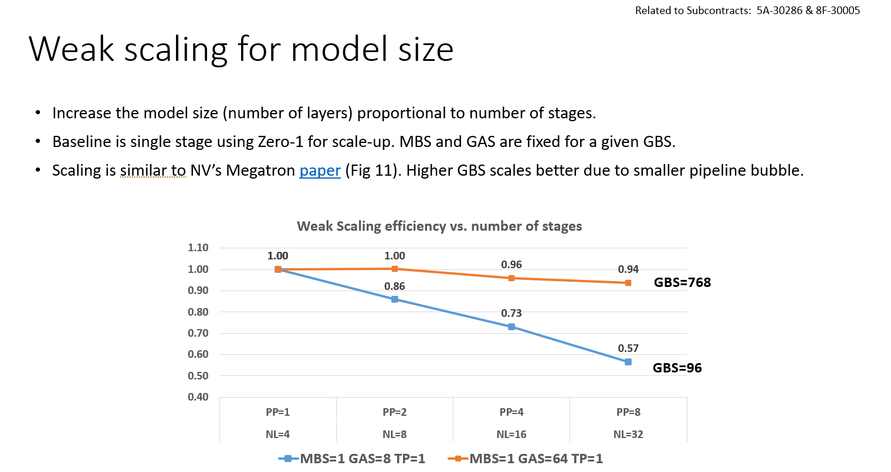

---
cssclasses:
  - row-hover
---

# Pipeline Parallelism Scaling on Perlmutter

## 2023-11-06

### Pipeline Parallelism Scaling with `MBS=1`

- Common across runs:
    - `CHECKPOINT_ACTIVATIONS = True`
    - `DATA_PARALLEL_SIZE=1`
    - `TENSOR_MODEL_PARALLEL_SIZE=8
    - `DS_SEQUENCE_PARALLEL_SIZE=1
    - `MICRO_BATCH_SIZE=1`
    - `SEQ_LENGTH=2048`

#### PPSIZE=1

| MODEL_SIZE | HOSTNAME  | GAS | WORLD_SIZE | FLASH_ATTN_V2 | PPSIZE | GBS | SAMPLES_PER_SEC | TFLOPS |
|:----------:|:---------:|:---:|:----------:|:-------------:|:------:|:---:|:---------------:|:------:|
|  GPT1T_2L  | nid008688 |  8  |     8      |     FALSE     |   1    |  8  |      1.04       | 35.86  |
|  GPT1T_2L  | nid008344 |  8  |     8      |     FALSE     |   1    |  8  |      1.02       | 35.35  |
|  GPT1T_2L  | nid008321 |  8  |     8      |     FALSE     |   1    |  8  |      1.01       | 35.06  |
|  GPT1T_2L  | nid008585 |  8  |     8      |     FALSE     |   1    |  8  |      0.94       | 32.44  |
|  GPT1T_2L  | nid008285 | 64  |     8      |     FALSE     |   1    | 64  |      2.36       | 81.94  | 

#### PPSIZE=2

| MODEL_SIZE | HOSTNAME  | GAS | WORLD_SIZE | FLASH_ATTN_V2 | PPSIZE | GBS | SAMPLES_PER_SEC | TFLOPS |
|:----------:|:---------:|:---:|:----------:|:-------------:|:------:|:---:|:---------------:|:------:|
|  GPT1T_4L  | nid008272 |  8  |     16     |     FALSE     |   2    |  8  |      0.87       | 29.22  |
|  GPT1T_4L  | nid008244 | 16  |     16     |     FALSE     |   2    | 16  |      1.40       | 46.88  |
|  GPT1T_4L  | nid008649 | 16  |     16     |     FALSE     |   2    | 16  |      1.38       | 46.41  |

#### PPSIZE=4

| MODEL_SIZE | HOSTNAME  | GAS | WORLD_SIZE | FLASH_ATTN_V2 | PPSIZE | GBS | SAMPLES_PER_SEC | TFLOPS |
|:----------:|:---------:|:---:|:----------:|:-------------:|:------:|:---:|:---------------:|:------:|
|  GPT1T_8L  | nid008221 |  8  |     32     |     FALSE     |   4    |  8  |      0.80       | 26.60  |
|  GPT1T_8L  | nid008256 | 32  |     32     |     FALSE     |   4    | 32  |      1.51       | 49.94  |
|  GPT1T_8L  | nid008256 | 32  |     32     |     TRUE      |   4    | 32  |      1.49       | 49.48  |
|  GPT1T_8L  | nid008256 | 32  |     32     |     TRUE      |   4    | 32  |      1.46       | 48.34  |
|  GPT1T_8L  | nid008256 | 32  |     32     |     TRUE      |   4    | 32  |      1.53       | 50.69  |
|  GPT1T_8L  | nid008256 | 32  |     32     |     TRUE      |   4    | 32  |      1.49       | 49.45  |
|  GPT1T_8L  | nid008256 | 32  |     32     |     TRUE      |   4    | 32  |      1.49       | 49.34  |
|  GPT1T_8L  | nid008193 | 64  |     32     |     FALSE     |   4    | 64  |      2.13       | 70.54  |

#### PPSIZE=8

| MODEL_SIZE | HOSTNAME  | GAS | WORLD_SIZE | FLASH_ATTN_V2 | PPSIZE | GBS | SAMPLES_PER_SEC |      TFLOPS       |
|:----------:|:---------:|:---:|:----------:|:-------------:|:------:|:---:|:---------------:|:-----------------:|
| GPT1T_16L  | nid008196 |  8  |     64     |     FALSE     |   8    |  8  |      0.75       | 24.59 |
| GPT1T_16L  | nid008456 | 64  |     64     |     FALSE     |   8    | 64  |      2.09       | 68.60 |
| GPT1T_16L  | nid008240 | 64  |     64     |     FALSE     |   8    | 64  |      2.51       | 82.48 |
| GPT1T_16L  | nid008456 | 64  |     64     |     FALSE     |   8    | 64  |      2.11       | 69.35 |

#### PPSIZE > 8

| MODEL_SIZE | HOSTNAME  | GAS | WORLD_SIZE | FLASH_ATTN_V2 | PPSIZE | GBS | SAMPLES_PER_SEC | TFLOPS |
|:----------:|:---------:|:---:|:----------:|:-------------:|:------:|:---:|:---------------:|:------:|
| GPT1T_32L  | nid008197 | 128 |    128     |     FALSE     |   16   | 128 |      2.69       | 88.00  |
| GPT1T_128L | nid008192 | 512 |    512     |     FALSE     |   64   | 512 |      2.98       | 97.32  |

| MODEL_SIZE | HOSTNAME  | GAS | WORLD_SIZE | FLASH_ATTN_V2 | PPSIZE | GBS | SAMPLES_PER_SEC | TFLOPS |
|:----------:|:---------:|:---:|:----------:|:-------------:|:------:|:---:|:---------------:|:------:|
| GPT1T_128L | nid008192 | 512 |    512     |     FALSE     |   64   | 512 |      2.98       | 97.32  |

## 2023-11-01
- [x] Repeat experiment from Deepak's email keeping the BS constant irrespective of number of pipeline stages
	
	 ✅ 2023-12-15
- Constants:
    - `SEQ_LENGTH`: `2048`
    - `MBS`: `1`
    - `GAS`: `8`
    - `GBS`: `8`
    - `SPSIZE`: `1`
    - `MPSIZE`: `8`
    - `DPSIZE`: 1
    - `CKPT_ACTIVATIONS`: True
    - `FLASH_ATTN_V2`: False

- RUNS:
    - `MODEL_SIZE: GPT1T_2L, args.world_size: 8, args.pipeline_model_parallel_size: 1`
        - SPS: 0.936
        - TFLOPS: 32.437
    - `MODEL_SIZE: GPT1T_4L, args.world_size: 16, args.pipeline_model_parallel_size: 2`
        - SPS: 0.8685
        - TFLOPS: 29.222
    - `MODEL_SIZE: GPT1T_8L, args.world_size: 32, args.pipeline_model_parallel_size: 4`
        - SPS: 0.8025
        - TFLOPS: 26.958
    - `MODEL_SIZE: GPT1T_16L, args.world_size: 64, args.pipeline_model_parallel_size: 8`
        - SPS: 0.7475
        - TFLOPS: 24.587
    
| MODEL_SIZE  | PPSIZE | SAMPLES_PER_SEC | TFLOPS |
|:-----------:|:------:|:---------------:| ------ |
| `GPT1T_2L`  |   1    |      0.936      | 32.437 |
| `GPT1T_4L`  |   2    |     0.8685      | 29.222 |
| `GPT1T_8L`  |   4    |     0.8025      | 26.958 |
| `GPT1T_16L` |   8    |     0.7475      | 24.587 |

(PPSIZE=8 / PPSIZE=1) ~ 75% efficiency

## 2023-10-30

- TODO:
    - [ ] Repeat `GPT1T_128L` with `MBS=1` 
    - [ ] Repeat experiment from Deepak's email keeping the BS constant irrespective of number of pipeline stages
      
### Pre Rebase

- [W&B Workspace: megatron-LM](https://wandb.ai/l2hmc-qcd/megatron-LM?workspace=user-saforem2)

| MODEL_SIZE | FLASH_ATTN | MBS | GBS | GAS | WORLD_SIZE | PPSIZE | SAMPLES_PER_SEC | TFLOPS |
|:----------:|:----------:|:---:|:---:|:---:|:----------:|:------:|:---------------:|:------:|
|  GPT1T_2L  |   FALSE    |  2  | 16  |  8  |     8      |   1    |      1.55       | 53.76  |
|  GPT1T_2L  |   FALSE    |  2  | 16  |  8  |     8      |   1    |      1.52       | 52.76  |
|  GPT1T_4L  |   FALSE    |  2  | 32  | 16  |     16     |   2    |      2.31       | 77.55  |
| GPT1T_16L  |   FALSE    |  2  | 128 | 64  |     64     |   8    |      3.24       | 106.66 |
| GPT1T_32L  |   FALSE    |  2  | 256 | 128 |    128     |   16   |      3.83       | 125.43 |
| GPT1T_64L  |   FALSE    |  2  | 512 | 256 |    256     |   32   |      4.05       | 132.57 |
^ppscaling-perlmutter-pre-rebase

### Post Rebase

- [W&B Workspace: GenSLM-Megatron-DS](https://wandb.ai/l2hmc-qcd/GenSLM-Megatron-DS?workspace=user-saforem2)

| MODEL_SIZE | FLASH_ATTN_V2 | MBS | GBS  | GAS | WORLD_SIZE | PPSIZE | SAMPLES_PER_SEC | TFLOPS |
|:----------:|:-------------:|:---:|:----:|:---:|:----------:|:------:|:---------------:|:------:|
|  GPT1T_4L  |     FALSE     |  2  |  32  | 16  |     16     |   2    |      2.14       | 71.96  |
|  GPT1T_4L  |     TRUE      |  2  |  32  | 16  |     16     |   2    |      2.15       | 72.25  |
|  GPT1T_4L  |     TRUE      |  2  |  32  | 16  |     16     |   2    |      2.05       | 69.06  |
|  GPT1T_8L  |     TRUE      |  2  |  64  | 32  |     32     |   4    |      2.10       | 69.65  |
|  GPT1T_8L  |     TRUE      |  2  |  64  | 32  |     32     |   4    |      2.26       | 74.96  |
| GPT1T_16L  |     FALSE     |  2  | 128  | 64  |     64     |   8    |      2.91       | 95.76  |
| GPT1T_16L  |     TRUE      |  2  | 128  | 64  |     64     |   8    |      2.98       | 97.87  |
| GPT1T_16L  |     FALSE     |  2  | 128  | 64  |     64     |   8    |      2.92       | 96.11  |
| GPT1T_16L  |     TRUE      |  2  | 128  | 64  |     64     |   8    |      2.92       | 96.08  |
| GPT1T_32L  |     FALSE     |  2  | 256  | 128 |    128     |   16   |      3.24       | 106.01 |
| GPT1T_64L  |     FALSE     |  2  | 512  | 256 |    256     |   32   |      3.61       | 118.17 |
| GPT1T_128L |     FALSE     |  2  | 1024 | 512 |    512     |   64   |      3.80       | 124.11 |
| GPT1T_128L |     FALSE     |  2  | 1024 | 512 |    512     |   64   |      3.67       | 120.18 |
^ppscaling-perlmutter-post-rebase


## 2023-10-25

- TODO:
    - **Try repeating PP scaling with older implementation (before rebase)**
    - `GPT1T_64L` with `BATCH_SIZE=2 FLASH_ATTN_V2=False`
    - `WORLD_SIZE=64` (16 nodes)
    - repeat: 32 nodes 

- Pipeline Parallelism Scaling up to 128 Nodes on Perlmutter
    - Constants across runs:
        - `MACHINE`: `Perlmutter`
        - `SEQ_LEN`: `2048`
        - `DPSIZE`: `1`
        - `SPSIZE`: `1`
        - `MPSIZE`: `8`
        - `CKPT_ACT`: `True`

### PPSIZE=2

|   MODEL_SIZE  |   FLASH_ATTN_v2  |   MBS  |    GBS  |   WORLD_SIZE  |   PPSIZE  |         TFLOPS        |
|:-------------:|:----------------:|:------:|:-------:|:-------------:|:---------:|:---------------------:|
|    GPT1T_2L   |       FALSE      |    4   |    32   |       16      |      2    |    73.87226537863980  |
|    GPT1T_2L   |       FALSE      |    4   |    32   |       16      |      2    |    68.19690741695100  |
|    GPT1T_2L   |       FALSE      |    4   |    32   |       16      |      2    |    70.40391460726580  |
^gpt1T2L-pp2-perlmutter

|   MODEL_SIZE  |   FLASH_ATTN_v2  |   MBS  |    GBS  |   WORLD_SIZE  |   PPSIZE  |         TFLOPS        |
|:-------------:|:----------------:|:------:|:-------:|:-------------:|:---------:|:---------------------:|
|    GPT1T_4L   |       FALSE      |    1   |    16   |       16      |      2    |    46.88460851152760  |
|    GPT1T_4L   |       FALSE      |    1   |    16   |       16      |      2    |   46.413119059179600  |
|    GPT1T_4L   |       FALSE      |    2   |    32   |       16      |      2    |    71.95842516718500  |
|    GPT1T_4L   |        TRUE      |    2   |    32   |       16      |      2    |    72.24538708911280  |
|    GPT1T_4L   |        TRUE      |    2   |    32   |       16      |      2    |    69.06456552418340  |
^gpt1T4L-pp2-perlmutter

### PPSIZE=4

|   MODEL_SIZE  |   FLASH_ATTN_v2  |   MBS  |    GBS  |   WORLD_SIZE  |   PPSIZE  |         TFLOPS        |
|:-------------:|:----------------:|:------:|:-------:|:-------------:|:---------:|:---------------------:|
|    GPT1T_8L   |       FALSE      |    1   |    32   |       32      |      4    |    49.94309719526840  |
|    GPT1T_8L   |        TRUE      |    1   |    32   |       32      |      4    |    49.48062799632150  |
|    GPT1T_8L   |        TRUE      |    1   |    32   |       32      |      4    |    48.34281461474090  |
|    GPT1T_8L   |        TRUE      |    1   |    32   |       32      |      4    |    50.6936076534672   |
|    GPT1T_8L   |        TRUE      |    1   |    32   |       32      |      4    |    49.45110045847100  |
|    GPT1T_8L   |        TRUE      |    1   |    32   |       32      |      4    |    49.34282736535150  |
|    GPT1T_8L   |        TRUE      |    2   |    64   |       32      |      4    |    69.65296278695570  |
|    GPT1T_8L   |        TRUE      |    2   |    64   |       32      |      4    |    74.96468032439180  |
^gpt1T8L-pp4-perlmutter

### PPSIZE=8

|   MODEL_SIZE  |   FLASH_ATTN_v2  |   MBS  |    GBS  |   WORLD_SIZE  |   PPSIZE  |         TFLOPS        |
|:-------------:|:----------------:|:------:|:-------:|:-------------:|:---------:|:---------------------:|
|    GPT1T_16L  |       FALSE      |    1   |    64   |       64      |      8    |    68.60202168037740  |
|    GPT1T_16L  |       FALSE      |    1   |    64   |       64      |      8    |    69.34939673967040  |
|    GPT1T_16L  |       FALSE      |    2   |    128  |       64      |      8    |    95.76424184409210  |
|    GPT1T_16L  |        TRUE      |    2   |    128  |       64      |      8    |    97.8716073724683   |
|    GPT1T_16L  |       FALSE      |    2   |    128  |       64      |      8    |    96.10683774933000  |
|    GPT1T_16L  |        TRUE      |    2   |    128  |       64      |      8    |    96.0792723587611   |
^gpt1T16L-pp8-perlmutter

### PPSIZE > 8

|   MODEL_SIZE  |   FLASH_ATTN_v2  |   MBS  |    GBS  |   WORLD_SIZE  |   PPSIZE  |         TFLOPS        |
|:-------------:|:----------------:|:------:|:-------:|:-------------:|:---------:|:---------------------:|
|    GPT1T_32L  |       FALSE      |    1   |    128  |       128     |     16    |    88.00215447899460  |
|    GPT1T_64L  |       FALSE      |    2   |    512  |       256     |     32    |   118.17491442145300  |
|   GPT1T_128L  |       FALSE      |    2   |   1024  |       512     |     64    |   124.10542111136300  |
^gpt1T-pp64-perlmutter

---

## Perlmutter Issues  [2023-10-18]

> [!bug]- OOM @ Perlmutter
> Trying to run `GPT1T_1L` on 4 (x 80GB A100) GPUs (1 Perlmutter node) crashes with OOM
> as we discussed yesterday, trying to run the `GPT1T_1L` on a single node with 4 GPUs with the following:  
> 
> MODEL_SIZE_KEY="GPT1T_1L" SEQ_LEN=2048 MICRO_BATCH=4 GAS=8 ZERO_STAGE=1 USE_SEQUENCE_PARALLEL=0 MPSIZE=4 PPSIZE=1 SPSIZE=1
> 
> is crashing with OOM, seemingly after getting through the first step.  
> (here's the [W&B run](https://wandb.ai/l2hmc-qcd/GenSLM-Megatron-DS/runs/n62ie6nb/overview?workspace=user-saforem2))
>
> ```bash
> 0: [2023-10-16 15:16:33,376] [INFO] [logging.py:96:log_dist] [Rank 0] time (ms) | fwd: 0.00 | bwd: 0.00 | bwd_inner: 0.00 | bwd_allreduce: 0.00 | step: 0.00
> 3:  iteration        1/      10 | consumed samples:           32 | consumed tokens:        65536 | elapsed time per iteration (ms): 31591.7 | learning rate: 5.062E-04 | global batch size:    32 | lm loss: 1.5752
> 55E+01 | loss scale: 4096.0 | actual seqlen:  2048 | number of skipped iterations:   0 | number of nan iterations:   0 | samples per second: 1.013 | TFLOPs: 37.10 |
> 2: [Rank 2] (after 1 iterations) memory (MB) | allocated: 7063.22802734375 | max allocated: 23105.095703125 | reserved: 35048.0 | max reserved: 35048.0
> 0: \[...\]
> 0: [Rank 0] (after 1 iterations) memory (MB) | allocated: 7063.22802734375 | max allocated: 23105.095703125 | reserved: 35048.0 | max reserved: 35048.0
> 0: [2023-10-16 15:16:33,386] [INFO] [profiler.py:80:start_profile] Flops profiler started
> 0: \[...\]
> 0: [2023-10-16 15:16:38,210] [INFO] [profiler.py:80:start_profile] Flops profiler started
> 0: slurmstepd: error: Detected 1 oom_kill event in StepId=17109804.0. Some of the step tasks have been OOM Killed.
> srun: error: nid008576: task 2: Out Of Memory
> srun: Terminating StepId=17109804.0
> ```

- TODO:
    - Try re-running recent Perlmutter (PPSCALING) results with `ACTIVATION_CHECKPOINTING=0`
        - Only for WORLD_SIZE=32, 64
    - Then scale up to 128 nodes
### Perlmutter Results

- Run Command: 
  ```bash
  # Setup
  module load libfabric cudatoolkit pytorch/2.0.1
  cd ~/m3957/foremans/projects/argonne-lcf/Megatron-DeepSpeed
  # Run Settings
  SPSIZE=1
  PPSIZE=2
  MPSIZE=8
  ZERO_STAGE=1
  SEQ_LEN=2048
  MICRO_BATCH=2
  SP_TYPE="megatron"
  USE_FLASH_ATTN_V2=1
  USE_SEQUENCE_PARALLEL=0
  # Scale GAS=(8 * PPSIZE), NLAYERS=(2 * PPSIZE)
  GAS="$(( 8 * PPSIZE ))" 
  MODEL_SIZE_KEY="GPT1T_$(( 2 * PPSIZE ))L"
  # Launch training
  ./ALCF/train-gpt3.sh
  ```

- Constants: `{MACHINE="Perlmutter", SEQ_LEN=2048, MBS=2, SPSIZE=1, MPSIZE=8, DPSIZE=1}`
	
| PPSIZE | MODEL_SIZE | WORLD_SIZE | SEQ_LEN | GBS | FLASH_ATTN_V2 | SAMPLES_PER_SEC | TFLOPS |
|:------:|:----------:|:----------:|:-------:|:---:|:-------------:|:---------------:|:------:|
|   1    |  GP1T_2L   |     8      |  2048   | 16  |     False     |      1.614      | 55.935 |
|   2    |  GPT1T_4L  |     16     |  2048   | 32  |     False     |      2.139      | 71.958 |
|   2    |  GPT1T_4L  |     16     |  2048   | 32  |     True      |       2.1       | 70.655 |
|   4    |  GPT1T_8L  |     32     |  2048   | 64  |     True      |      2.182      | 72.309 |
|   8    | GPT1T_16L  |     64     |  2048   | 128 |     False     |      2.917      | 95.936 |
|   8    | GPT1T_16L  |     64     |  2048   | 128 |     True      |      2.948      | 96.975 |
^pp-perlmutter

### Intel Results

| PPSIZE | DP=1 | DP=2 | Scaling (\%) |
|:----------:|:--------:|:--------:|:-----------:|
|  1  |   63.8   |   51.2   |    80.3    |
|  2  |   64.8   |   57.1   |    88.1    |
|  8  |   66.8   |   63.4   |    94.9    |
| 16  |   67.5   |   65.6   |    97.2    |
^ppscaling

: [Table Pipeline Scaling](#tbl-pp): `PPSIZE` Scaling on Intel GPU with `{TP=12, MBS=2, GAS=8*PP, NLAYERS=2*PP}` {#tbl-pp}

| PP  | LAYERS | MBS | GBS | TFLOPS | SAMPLES_PER_SEC | 
|:---:|:------:|:---:|:---:|:------:|:---------------:|
|  2  |   4    |  1  | 16  |  54.7  |       2.5       |
|     |   4    |  2  | 32  |  64.8  |       2.9       |
|     |   4    |  4  | 64  |  71.6  |       3.2       |
|  8  |   16   |  1  | 64  |  59.4  |       2.7       |
|     |   16   |  2  | 128 |  66.8  |       3.1       |
| 16  |   32   |  1  | 128 |  60.5  |       2.8       |
|     |   32   |  2  | 256 |  67.5  |       3.1       |
| 32  |   64   |  1  | 256 |  60.0  |       2.8       |
|     |   64   |  2  | 512 |  OOM   |       OOM       |
|     |   62   |  2  | 512 |  67.5  |       3.2       |
^ppscaling-detailed

: [Table Pipeline Scaling Detailed](#tbl-ppdetail): Detailed Pipeline Parallelism Scaling Results on Intel GPU  {#tbl-ppdetail}
