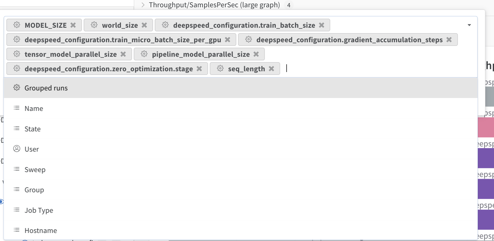

# Sync w/ Venkat

> [!hint]- GroupBy in W&B
> - Convenient group by settings in W&B:
> 	- MODEL_SIZE
> 	- world_size
> 	- seq_length
> 	- pipeline_model_parallel_size
> 	- tensor_model_parallel_size
> 	- zero_stage > - use_flash_attn
> - checkpoint_activations

## BigScience
- `fas:Github` [bigscience-workshop/bigscience](https://github.com/bigscience-workshop/bigscience)
- [bigscience-workshop/Megatron-DeepSpeed](https://github.com/bigscience-workshop/Megatron-DeepSpeed)
- [Which hardware do you need to train a 176B parameters model?](https://bigscience.huggingface.co/blog/which-hardware-to-train-a-176b-parameters-model)
	- [Chronicles: Prequel](https://github.com/bigscience-workshop/bigscience/blob/master/train/tr11-176B-ml/chronicles-prequel.md#a100-experiments)
	- [Big Science Model Training Launched](https://bigscience.huggingface.co/blog/model-training-launched)
	- [Rule of thumb for optimizing TFLOPS](https://github.com/bigscience-workshop/bigscience/blob/master/train/tflops_optimization.md)
	- [Lessons Learned](https://github.com/bigscience-workshop/bigscience/blob/master/train/lessons-learned.md)

---
# Meeting Notes

# 2024-01

## 2024-01-12

- LLM Drop
- Aurora GPT
    - Variant to go forward for GB
- Stormer-dev
    - Rao to go for GB
    - Resources now that ThetaGPU offline ??
- `wordplay`
- Summer student (Soumya Ganguly)
    - Machine Learning with Reduced Precision for Lattice QCD
        - Simulations in lattice gauge theory and lattice QCD are plagued by large memory and high bandwidth requirements.
        - Significant advancements in both hardware and software will be required to run simulations at the level required by current and upcoming physical experiments.
            - In Section 2.3 from [1]:
              > These simulation goals clearly demonstrate a need for computers at least 10x more capable than the coming Exaflop computers.
        - This project will look at using reduced / mixed floating point precision for ML models and workflows for Lattice QCD, and investigate methods for improving upon current approaches.
            - In Section 3.5 from [1]:
                > Reduced precision formats using non-IEEE mantissa and significand have been found to be useful in Machine Learning including non-IEEE 16-bit [36, 37] and 8-bit arithmetic [38]. A joint patent for a hardware implementation for the modified 16 bit floating point format was submitted by one of the authors (PB) with Intel in 2018 [36] wherein it was demonstrated to provide better support for training in machine-learning.
        - ~~There are many potential avenues for improvement over todays current approaches, virtually all of which are well-aligned with the DOE's scientific mission and are thoroughly outlined in the~~
            
- Sleep study / Emmanuel Mignot project
- Arvind to go for SC paper on work w/ Gautham
- https://github.com/huggingface/transformers/blob/main/src/transformers/models/llama/configuration_llama.py
- Test Llama 2 in Megatron DS 
    - Pull in Murali / look at performance
    - Repeat work w/ Scott to repeat performance numbers on Aurora
    - Work on building model for estimating performance
    - Understand / workout performance metrics


[1]: https://arxiv.org/abs/2204.00039
    


# 2023-12

# 2023-11


# 2023-10

### 2023-10-24

- Keep pushing towards full `GPT1T_128L` on 128 Nodes of Perlmutter (512 GPUs)
- Start working on AI4Science Training Series material
- Continue testing / working on `ezpz`

## 2023-10-20

- Discussion with Chris Graziul about hparam sweeps with W&B, generally interested in collaboration on distributed computing efforts
- Schedule initial meeting with {Emmanuel Mignot, Zhiyong Zhang} (@Stanford) about possible collaboration on Foundation models for [Sleep Study work](https://sleep.hms.harvard.edu/news/emmanuel-mignot-wins-breakthrough-prize-discovering-cause-narcolepsy) 
- Performance Evaluations ??
- Presentation on Saturday @ Intel OneAPI Workshop @UIC
    - Keep looking through slides and get clarification on anything that isn't clear	
- LLM Workshop in November
- [x] All set for SC23 
    

- Intel LLM Discussions

# 2023-09


## 2023-09-22

- [ ] Push toward s full 1T model on Perlmutter
	- Scale up `num_layers` across increasing node counts towards full model
- Find better way of identifying system name

- **Figure out how to get embeddings out from Megatron model** and work with Kyle / Alex to get quantitative measurements from long sequence lengths
    - Use / reference example code from Alex
    ```python
    def generate_embeddings(model, dataloader):
    embeddings = []
    with torch.no_grad():
        for batch in tqdm(dataloader):
            batch = batch.to(model.device)
            outputs = model(**batch, output_hidden_states=True)
            last_hidden_states = outputs.hidden_states[-1]
            seq_lengths = batch.attention_mask.sum(axis=1)
            for seq_len, elem in zip(seq_lengths, last_hidden_states):
                # Compute averaged embedding
                embedding = elem[1 : seq_len - 1, :].mean(dim=0).cpu().numpy()
                embeddings.append(embedding)

    return np.array(embeddings)
     ```
- Keep pushing on Climate Model with Vision Transformer


# 2023-08

## 2023-08-21

- ThetaGPU (bigmem) node:
	- Megatron-DS-Benchmarking:
		- `MODEL_SIZE_KEY="GPT145B_12L" SEQ_LEN=2048 USE_FLASH_ATTN=1 MICRO_BATCH=1 GAS=1 SP_TYPE="megatron" ./ALCF/train-gpt3.sh`
		  crashes with:
	   ```bash
	   RuntimeError: CUDA error: an illegal memory access was encountered
	   CUDA kernel errors might be asynchronously reported at some other API call, so  the stacktrace below might be incorrect.
	   For debugging consider passing CUDA_LAUNCH_BLOCKING=1.
	   Compile with `TORCH_USE_CUDA_DSA` to enable device-side assertions.
	   ```
	- full logfile:
		- `/lus/grand/projects/datascience/foremans/locations/thetaGPU/projects/saforem2/Megatron-DS-Benchmarking/outputs/gpt_SP_actCkpt_flashAttn_GPT145B_12L_z0_seqlen2048_mp8_pp1_sp1_nl12_hs12288_gb1_mb1/logs/foremans-thetagpu23-nhosts1-ngpu8-2023-08-21-154739.log`

## 2023-08-18

- [ ] [Megatron-DS-Benchmarking](../../../0004-Inbox/Megatron-DS-Benchmarking.md)

## 2023-08-17

### Intel Innovate Sync

- [ ] **no** `flash-attn` for experiments
	- [ ] Seemingly, `TP>1` eats away at the improvement from `flash-attn`, essentially erasing any improvements we get from using `flash-attn`
 - [ ] Continue / finish experiments on Perlmutter 
	 - [ ] + ThetaGPU (full-node, 8 GPUs / node), should see speedup compared to Polaris since no intra-node communication
- [ ] Move focus to `1T` model

- [ ] **Want to show PVC is AS GOOD as 80GB A100** (main story)
- [ ] PVC is competitive (if not better than) Frontiero

- [ ] Try with Flash attn both on and off on ThetaGPU (using `saforem2/Megatron-DeepSpeed`)

# 2023-07

## 2023-07-19

- Prioritize Perlmutter runs
- Aggregate / review data + make comparisons
	- esp. b/t NVIDIA/Megatron-LM + saforem2/Megatron-DeepSpeed
- Investigate / figure out where factor $1000\times$ is coming from in throughput measurements from `NVIDIA/Megatron-LM`

## 2023-07-09

### [Megatron-LM-Nvidia](https://wandb.ai/l2hmc-qcd/Megatron-LM-Nvidia?workspace=user-saforem2)

- [volcanic-elevator-78]

- W&B: `Megatron-LM-NVIDIA`
	- <iframe src="https://wandb.ai/l2hmc-qcd/Megatron-LM-Nvidia?workspace=user-saforem2" style="border:none;height:512px;width:100%" />
>

## 2023-07-04

- [ ] Finish GPT-3 (175B) experiments on ~~24~~, 32, 64 nodes for `MICRO_BATCH=1,2`
	- [ ] Figure out discrepancy between `env.GAS` and `ds_config.GAS` in `WORLD_SIZE=256` runs ??
		- [ ] caused by `env.global_batch < WS * MB * GAS / (MPSIZE * PPSIZE)` ??
	- [ ] **Bad run**(s): 
		- [lyric-galaxy-1020](https://wandb.ai/l2hmc-qcd/megatron-LM/runs/754qahzc?workspace=user-saforem2)
		- [comic-water-1027]
		- [dazzling-eon-1013]
		- [prime-dawn-1023]

## 2023-07-03
#### 175B Model
- Aggregated everything (so far) for the 175B model into a [W&B report](https://wandb.ai//l2hmc-qcd/megatron-LM/reports/GPT-3-ALCF-175B---Vmlldzo0Nzk5MzE4)
	- `TP=8`
	- `PP=16`
	- `FA=1`
	- `MB={1,2}`
	- `NUM_NODES={32,64}`
	- `WORLD_SIZE={128,256}`
	- `GAS={8,16,32,64,128,256}`

## 2023-07-02
#### 175B Model

- Issue due to `env.GLOBAL_BATCH < WORLD_SIZE * MICRO_BATCH * GAS / (MPSIZE * PPSIZE)` ??
- [BAD RUN](https://wandb.ai/l2hmc-qcd/megatron-LM/runs/754qahzc/files/output.log)

# 2023-05
## 2023-05-25
- [ ] Look at H<sup>3</sup>:from HazyResearch
- [ ] How to get 1T Model working with 2k, 8k, 16k, 32k seq len
	- [ ] `ZeRO=1 + FA + [PP > 1]
	- [ ] Identify first 8 experiments to try here
- [ ] Try working with NeMO / get working familiarity to compare against `Megatron-DeepSpeed`

## 2023-05-17
- Collaboration with Haky Im (ImLab) @ U. Chicago from INCITE Hackathon
	- Working on implementing / scaling [Enformer](https://github.com/lucidrains/enformer-pytorch) for predicting gene expression
- LDRD Climate proposal w/ Rao, Romit, Bethany, Troy, ...
- DeepSpeed $\leftrightarrow$ `GenSLM`:
	- Sent Leon [saforem2/Megatron-DeepSpeed](https://github.com/saforem2/Megatron-DeepSpeed)
	- Do they have access to: ??
		- [`ramanathanlab/genslm-develop`](https://github.com/ramanathanlab/genslm-develop)
		- [`globus-labs/multi-rl-workflow`](https://github.com/globus-labs/multi-rl-workflow)
- Reach out to Huihuo + close loop on MPI Collective profiling project (w/ Murali, Sid, Zhen)
	- Look at [`microsoft/NPkit`](https://github.com/microsoft/NPkit)
- Work on determined.ai repo before meeting Tuesday
- Find time to sit down and talk through Megtron-DeepSpeed (in person, early next week)

## 2023-05-11
- `GenSLM` $\longleftrightarrow$ `DS4Sci` Meeting:
  > [!TLDR]- [$\texttt{GenSLM}\leftrightarrow\texttt{DS4Sci}$] **Minjia's Summary**:
  >  1. A 25B GPT-NeoX like genome model has been created using Megatron-DeepSpeed, and the team is interested in further scaling the model. However, Nvidia has been adding new features to the Megatron code repository, such as rotation embedding and flash attention, which are not yet included in Megatron-DeepSpeed. One action item is to update Megatron-DeepSpeed to include these recent features. One possibility is to rebase the Megatron-DeepSpeed repo and include all changes recently from Megatron. However, this may require a lot of efforts (e.g., resolving tons of conflicts and correctness tests). As we know that Megatron-DeepSpeed has been well tested for training the BLOOM 175B, it may be more efficient to selectively add important features such as rotation embedding and flash attention to Megatron-DeepSpeed. To do that, Venkat and the team can provide a list of important features to be added.
  > 2. The team is also interested in extending training capability to longer sequences. The current model can be trained on 8-16 GPUs with a max sequence length of 16K. However, the team is interested in experimenting longer sequences, which require system support to both enable long sequence training (e.g., 32K). Various system level optimizations such as TP, zero1/2/3 have been trained in the past, but we may revisit this problem to find quicker ways to enable longer sequence training without using sequence parallelism.
  > 2. There is also interest in scaling large model training on 256 or even 60K GPUs. This is a long-term project that may involve Intel. Minjia will talk with Intel + DS support and get back to Venkat to initiate another discussion.
  > 3. Throughput-oriented inference performance optimization. The trained model is used in a simulation pipeline, where improving the inference efficiency helps accelerating the simulation process. Venkat conjectured that there is a huge room for inference efficiency improvements, which may require custom kernel optimizations.

## 2023-05-10
- [bigscience/experiments/gpt2.md](https://github.com/bigscience-workshop/bigscience/blob/master/experiments/gpt2.md)
- Working on [LLM Evaluation on AI Accelerators](https://www.overleaf.com/project/6437e62ceed37522113547e5)
- INCITE Hackathon
	- Discussion with Hae Kyung Im about collaboration / next steps
- PASC23
	- [x] Registered + forwarded to India
	- Travel Plan (+ paperwork) moving along
- Plan to meet with Denis Boyda about scaling large models
- Ongoing (once ALCF back up):
	- Model / Pipeline Parallelism in native `DeepSpeed`
- [x] Reached out to Gautham, seems to have resolved inference issues


# 2023-04

## 2023-04-26
- [x] Try 25B with `MPSIZE=2|4` ZERO=1 with Flash Attention
	- [x] Compute `global_batch_size = (micro_batch_per_gpu * num_ranks) / MPSIZE`
 	where `num_ranks = num_hosts / gpu_per_host`
	- [x] Compute `global_batch` explicitly from `micro_batch`  
  
- [ ] `ZERO=1`
	- [ ] **whatever works with flash attention for ZeRO=1**
	- [ ] Scale up micro batch until OOM
	- [ ] Repeat on `bigmem` queue on ThetaGPU (w/ new environment	)

## 2023-04-19
- Gautham issues with fine-tuning
	- Inference issues
- 1T model with PILE
- 25B w/ 5760 
- 13B
- Repeat with best MP / MICRO_BATCH / GLOBAL_BATCH settings on 8 --> 16 --> 32 ...
	- want to demonstrate performance numbers to Intel to show comparison

# 2023-03

## 2023-03-29
- Try 13B / 20B Model with 16k / 32k Seq Length
	- TP, MP, ZeRO > 1 
- Katie Simz- about CNPS

## 2023-03-22

- 25th & 26th travel dates
- Draft up email to Mike with Maruti's request

- [Some Techniques To Make Your PyTorch Models Train (Much) Faster](https://sebastianraschka.com/blog/2023/pytorch-faster.html#6-deepspeed)

## TODO:
- Repeat [Performance Study](https://wandb.ai/l2hmc-qcd/megatron-LM/reports/Performance-Study--VmlldzozODYwMjIw) for 16k -> 32k seq_length
	- And again for 20B model 2k
	- Test on single node, scale out for larger models + seq_len's
	- Repeat with 20B 16k 32k seq length
	- Try for 100B model, scale out to multi-node
	- Try for 1T model 
	- Queue jobs in parallel
- Work with Huihuo + Murali to get communication profiles

## 20B Model
- flash attn + ckpt for all
- 4 Nodes:
	- 1st case:
		- Model Parallel = 4 , PP = 1, ZeRO = 1
		- Model Parallel = 4 , PP = 4, ZeRO = 1
		- Model Parallel = 8 , PP = 4, ZeRO = 1
	- 2nd case:
		- MP = 1|4|8|16, PP = 1, ZeRO = 2
		- MP = 1|4|8|16, PP = 1, ZeRO = 3
- Repeat for 2k -> 16k -> 32k seq_len
- Then this will give direction for scaling model size (to 1T) + longer seq_lens


- Config options:
	1. world_size: 16, pipeline_model_parallel_size: 1, use_flash_attn: true, zero_stage: 1, checkpoint_activations: false
	2. world_size: 16, pipeline_model_parallel_size: 1, use_flash_attn: false, zero_stage: 1, checkpoint_activations: false
	3. world_size: 16, pipeline_model_parallel_size: 1, use_flash_attn: true, zero_stage: 1, checkpoint_activations: true
	4. world_size: 16, pipeline_model_parallel_size: 1, use_flash_attn: false, zero_stage: 1, checkpoint_activations: true
	5. world_size: 16, pipeline_model_parallel_size: 1, use_flash_attn: false, zero_stage: 2, checkpoint_activations: false
	6. world_size: 16, pipeline_model_parallel_size: 1, use_flash_attn: false, zero_stage: 2, checkpoint_activations: true
	7. world_size: 16, pipeline_model_parallel_size: 1, use_flash_attn: true, zero_stage: 2, checkpoint_activations: true
	8. world_size: 16, pipeline_model_parallel_size: 1, use_flash_attn: true, zero_stage: 2, checkpoint_activations: false
	9. world_size: 16, pipeline_model_parallel_size: 1, use_flash_attn: true, zero_stage: 3, checkpoint_activations: true
	10. world_size: 16, pipeline_model_parallel_size: 1, use_flash_attn: true, zero_stage: 3, checkpoint_activations: false
	11. world_size: 16, pipeline_model_parallel_size: 2, use_flash_attn: false, zero_stage: 1, checkpoint_activations: true
	
## 2023-03-21
- Looking at experiment design for GPT models
- Scaling sequence length
- ==Refine results, aggregate for particular model size (2.7B)==
	- full node / multi-node
	- repeat for 20B model (start w/ 16k --> 32k)
		- ZeRO3 + Flash attention
		- ZeRO1 + PP = 4 / 8 + MP = (shouldn't go beyond # GPUs / node) + Flash Attention
		- multi-node 100B (start w/ 16k --> 32k)
			- ZeRO3 + Flash Attention
			- ZeRO1 + PP = 4 / 8 + MP = (shouldn't go beyond # GPUs / node) + Flash attention
- Use GenSLM [GPTNEOx](https://github.com/EleutherAI/gpt-neox) architecture in Megatron-DeepSpeed

## 2023-03-15
- Look at `Dragon==0.4` release on Polaris with multi-node + PBS Suppor
- Fill out GenSLM performance table for smaller models + compare DeepSpeed (+ knobs) / FSDP
- Keep pushing on GenSLM project / schedule brief call ??
- [x] Finish draft to cels-hr about Eshaan ✅ 2023-03-22
- [x] Send congrats / welcome email to Eshaan ✅ 2023-03-22
- Reach out to India / fill out CELS Travel Request form

## 2023-03-08
- [x] ALCF down for maintenance Monday 2023-03-06 ✅ 2023-03-22
- [x] Reached out to Eshaan Arakoni about summer research position
- [x] Environment issues on ThetaGPU / Polaris
	- [ ] discussion w/ Kyle 
	- [ ] tracking in [box note](https://anl.app.box.com/notes/1124584874420)
- [x] Met with Troy to discuss `cnn4esm` status ✅ 2023-03-22
	- [x] Implemented fix in pytorch for normalization bug related to `MinMaxScaler` w/ multi-GPU training ✅ 2023-03-22
- [x] **Passport appointment Monday!** ✅ 2023-03-22
- [x] Submitted abstract for DeepFridays talk @ U Bologna ✅ 2023-03-22
- [x] Get details of data, model, big-picture ideas for `cnn4esm` 
- [x] Make sure FSDP is not initializing DeepSpeed **AT ALL**
- [x] Will put me in touch with Kyle Hippe about DeepSpeed / MPI optimizations for `GenSLM`


## 2023-03-03

- [ ] [`bigscience-workshop/Megatron-DeepSpeed`](https://github.com/bigscience-workshop/Megatron-DeepSpeed#distributed-pretraining)


- [ ] Look at building out W&B launcher
- [x] Send notes to Venkat

- [ ] See how DeepSpeed vs FSDP utilizes NCCL scale up to 128 nodes on Polaris
	- [ ] Make baseline to compare against
- [x] Flash attn allows for longer sequence lengths, try up to 16k 32k
	- [x] Try with larger model sizes 

- [x] Scale model size to 25B
- [x] FSDP w/ all the bells and whistles
	- [x] ZeRO 3
	- [x] 2K seq len
	- [x] see what combinations work (MP / PP))
	- [x] PP scale out to 4/8 GPUs
- [x] Baselines w/ 4 / 8 GPUs on Polaris
	- [x] MP = 1 PP = 1 ZeRO=1
	- [x] MP > 1 PP = 1 ZeRO>1
	- [x] etc
	- [x] FSDP with everything on
		- [ ] Look at specifics
	- [x]  ✅ 2023-03-22

> [!summary] Summary
> - Tested different combinations of `MPSIZE`, `PPSIZE`, `ZERO_LEVEL`, summarized in table below
> - Tried switching `NCCL_P2P_DISABLE=1|0`
> - [Added support](https://github.com/saforem2/Megatron-DeepSpeed/commit/6cb3765ea2428b35f4f89ee0b25f90c0e568c59c) for `flash-attn` 
> - [Added support](https://github.com/saforem2/Megatron-DeepSpeed/commit/4611aeefc4faa2e9ef415c9c4a2f8c8cdf0d7757) for Fully Sharded Data Parallel (`--DDP-impl FSDP`)

- MP / PP / ZeRO Tests:

| Status | MP  | PP  | ZeRO |
|:------:|:---:|:---:|:----:|
|  ️✅   | = 1 | = 1 | = 1  |
|  ️✅   | = 1 | = 1 | > 1  |
|   ✅   | > 1 | = 1 | > 1  |
|   ✅   | > 1 | > 1 | = 1  |
|   ❌   | > 1 | > 1 | > 1  |
|   ❌   | = 1 | > 1 | > 1  |

- [x] Try adding [`FSDP`](https://pytorch.org/tutorials/intermediate/FSDP_tutorial.html) to [Megatron-DeepSpeed](https://github.com/saforem2/Megatron-DeepSpeed)
	- [p] ~~Seems to give **significant** speedup (`~133 TFLOPs`)~~
	- W&B run: [radiant-pine-262](https://wandb.ai/l2hmc-qcd/megatron-LM/runs/qclqud3t?workspace=user-saforem2)
	- logfile:
		```Shell
		LOGFILE=" \
		/GPT3_6.7B_z1_seqlen2048_mp1_pp1_nl32_hs4096_gb1024_mb1/ \
		/logs \
		/foremans-thetagpu19-nranks2-ngpu16-2023-03-03-114043.log"
		```

- [x] Try turning off MP w/ ZeRO > 1

	- [p] `{MP: 1, PP: 1, ZeRO: 2}` working:[^prefix]
		`GPT3_6.7B_z2_seqlen2048_mp1_pp1_nl32_hs4096_gb1024_mb1/*`
 
	- [c] `{MP: 1, PP: 2, ZeRO: 2}` **not** working:
		`GPT3_6.7B_z2_seqlen2048_mp1_pp2_nl32_hs4096_gb1024_mb1/*`

	- [p] `{MP: 8, PP: 1, ZeRO: 2}` working:
		`GPT3_6.7B_z2_seqlen2048_mp8_pp1_nl32_hs4096_gb1024_mb1/*`

- [x] Try again with Flash Attn:
	- [x] Added [`flash-attn`](https://github.com/HazyResearch/flash-attention) support to
	- [W&B run (hardy-disco-255)](https://wandb.ai/l2hmc-qcd/megatron-LM/runs/nmd8mu3x?workspace=user-saforem2)
	- logfile:
		```Shell
		LOGFILE="\
		  /outputs \
		  /GPT3_6.7B_z2_seqlen2048_mp8_pp1_nl32_hs4096_gb1024_mb1/ \
		  /logs \
		  /foremans-thetagpu04-nranks4-ngpu32-2023-03-02-173339.log"
		```

- [c] Try increasing PP size and see if it works with ZeRO > 1
	- [c] `{MP: 1, PP: 2, ZeRO: 2}` **not** working:
		`GPT3_6.7B_z2_seqlen2048_mp1_pp2_nl32_hs4096_gb1024_mb1/*`

- [x] PP across 2 ThetaGPU nodes
	- [/] Then try adding MP
	- When PP = 1 --> Put everything on 1 GPU
		- scaling up will try and put more layers on GPU
	- `ENABLE_FLASH_ATTN=0`:
		- logfile:
			```Shell
			LOGFILE="\ 
				 /GPT3_6.7B_z1_seqlen2048_mp8_pp16_nl32_hs4096_gb1024_mb1/ \
				 /logs \
				 /foremans-thetagpu04-nranks2-ngpu16-2023-03-03-072247.log"
			```
		- W&B Run: 🚀 [wobbly-paper-259](https://wandb.ai/l2hmc-qcd/megatron-LM/runs/mg3s02ip)
	- `ENABLE_FLASH_ATTN=1`:
		- logfile:
			```Shell
			LOGFILE="\
				/GPT3_flashAttn_6.7B_z1_seqlen2048_mp8_pp16_nl32_hs4096_gb1024_mb1/ \
				/logs \
				/foremans-thetagpu04-nranks2-ngpu16-2023-03-03-002517.log"
		  ```
		  - W&B Run: 🚀 [glamorous-lion-257](https://wandb.ai/l2hmc-qcd/megatron-LM/runs/u9mby2d3)
  
- [x] Try turning `NCCL_P2P_DISABLE=1` off and repeat
	- command:
		```Shell
		NCCL_P2P_DISABLE=1 # | 0 \
		CFLAGS="-I${CONDA_PREFIX}/include/" \
		LDFLAGS="-L${CONDA_PREFIX}/lib" \
		TORCH_EXTENSIONS_DIR=./cache/torch_extensions/  \
		./ALCF/pretrain_gpt-ALCF.sh
		```
	- [x] `NCCL_P2P_DISABLE=0`:
		 ```Shell
		LOGFILE="\
			/outputs \
			/GPT3_6.7B_z2_seqlen2048_mp8_pp1_nl32_hs4096_gb1024_mb1/ \
			/logs \
			/foremans-thetagpu04-nranks4-ngpu32-2023-03-02-150811.log"
		 ```
	- [x] `NCCL_P2P_DISABLE=1`:
		 ```Shell
		LOGFILE="/outputs \
		    /GPT3_6.7B_z2_seqlen2048_mp8_pp1_nl32_hs4096_gb1024_mb1 \
		    /logs \
		    /foremans-thetagpu04-nranks4-ngpu32-2023-03-02-153120.log"
		 ```
	 
- [/] Start drafting up results and methods etc

[^prefix]: 
      - `LOGDIR` on ThetaGPU: 
      `~/datascience/foremans/locations/ThetaGPU/projects/saforem2/megatron-DeepSpeed/`

# 2023-02

## 2023-02-23

- [!] W&B Updates ??

- [x] Try turning off MP w/ ZeRO > 1
- [x] Try again with `flash-attn`
- [x] Try increasing `PPSIZE>1` and see if it works with `ZeRO>1`
- [x] `PPSIZE>1` across 2 ThetaGPU nodes
- [x] Try switching `NCCL_P2P_DISABLE=0|1` 
- [/] Start drafting up results, methods, etc.

## 2023-02-22

- Add MPICH Multinode Runner in DeepSpeed [microsoft/DeepSpeed/pull/2839](https://github.com/microsoft/DeepSpeed/pull/2839/files): 
- [ ] **W&B Progress** / Update to Will ??
    - Update materials / slide deck for Mike ?
- **PASC23 Approved**
    - Passport / discuss travel with Venkat

### LLMs

- Incompatibility between Sunspot `gpt3.6b.sh` and Polaris `gpt3.6b.sh`

- [ ] Raised issue [DeepSpeed #2853](https://github.com/microsoft/DeepSpeed/issues/2853)
    - [ ] Submitted PR https://github.com/microsoft/DeepSpeed/pull/2854
    - [ ] fork @ 
	    - `~/datascience/foremans/locations/polaris/projects/saforem2/DeepSpeed/`
	    - `~/datascience/foremans/locations/thetaGPU/projects/saforem2/DeepSpeed/`
- [x] Multi-node training works:
    - [x] **Polaris** with `conda/2023-01-10` environment
    - [x] **ThetaGPU** with `conda/2022-07-10` environment


## 2023-02-15

### Megatron-DeepSpeed
- [x] Created fork at [saforem2/Megatron-DeepSpeed](https://github.com/saforem2/Megatron-DeepSpeed)
- [x] Multi-node working on ThetaGPU
- [x] Multi-node working on Polaris

- [ ] Check on Model Parallel + ZeRO settings (incompatibility?)
- Intel claims improvement over A100
- Compare performance A100 (40GB / 80GB) / SunSpot on single node
    - Ensure consistent options
- Try adding MP, TP, ZeRO Offloading and measure improvements
- Compare `pretrain_gpt.py` with version from Intel Extension 
- Build / test `MPICHRunner(...)` from https://github.com/microsoft/DeepSpeed/blob/master/deepspeed/launcher/multinode_runner.py
    - Compare with Intel's version 
- Detailed performance comparison: A100 Node vs PVC
- Try scaling `seq_len` for Megatron-DeepSpeed
    - `1024 --> 2048 --> 4096`
    - Try w/ 6B Parameter
- Try flash attn
- Repeat w/ GenSLM
    - Impact of running w/ longer `seq_len`
- Raise issue on DeepSpeed with
    - `AssertionError: ZeRO-2 and ZeRO-3 are incompatible with pipeline parallelism`
    - Try with Tensor Parallelism


## 2023-02-13

- Updates @ [Megatron-DeepSpeed](Megatron-DeepSpeed.md)


## Megatron-DeepSpeed
 - [github](https://github.com/microsoft/Megatron-DeepSpeed)
 - ThetaGPU:
     - [x] Single
- `Megatron-DeepSpeed` on ThetaGPU

```Shell
$ cd /lus/grand/projects/datascience/foremans/locations/thetaGPU/projects/microsoft/Megatron-DeepSpeed/
$ ./pretrain_gpt.sh
$ module load conda/2022-07-01 ; conda activate base
$ LOCAL_RANK=0 python3 pretrain_gpt.py --tensor-model-parallel-size 2 --pipeline-model-parallel-size 2 --num-layers 24 --hidden-size 1024 --num-attention-heads 16 --micro-batch-size 4 --global-batch-size 16 --seq-length 1024 --max-position-embeddings 1024 --train-iters 500000 --lr-decay-iters 320000 --vocab-file gpt2-vocab.json --merge-file gpt2-merges.txt --data-impl mmap --split 949,50,1 --distributed-backend nccl --lr 0.00015 --lr-decay-style cosine --min-lr 1.0e-5 --weight-decay 1e-2 --clip-grad 1.0 --lr-warmup-fraction .01 --checkpoint-activations --log-interval 100 --save-interval 10000 --eval-interval 1000 --eval-iters 10 --fp16 --data-path ./dataset/BookCorpusDataset_text_document --deepspeed_config ds_zero2_config_bf16.json
```

## 2023-02-10
- Invited to give talk @ University of Bologna on 4/21/23 (c/o Andrea Asperti)
- Mini Symposium on [Machine Learning for Subsurface Energy, Hydrology, and Earth Sciences](https://17.usnccm.org/704) @ [USNCCM17](https://17.usnccm.org/) 
- PASC23 announcement incoming on 2/15
- Working w/ Romit on Earth Shot proposal for CNN-ESM
    - Thoughts on single vs multiple process tracking with W&B?
- Navigator for new postdoc Archit
- Summer students approved by Mike
    - Decided not to go forward with SRP match (bit confused about matching process)
    - Look @ SULI students?
- W&B:
    - Met w/ Will, said we still plan to continue going forward and will follow back up **soon**
    - Update slides (?) / prepare pitch for Mike (?)

## Model Parallel
- Installed / tested `gpt3.6bn.sh` from Intel w/ DeepSpeed on Sunspot

> [!INFO]- GPT 3.6bn log
> ```Shell
> $ ./scripts/gpt-3.6b.sh
> deepspeed --num_nodes 1 --num_gpus 12 pretrain_gpt2.py --model-parallel-size 1 --num-layers 30 --hidden-size 3072 --num-attention-heads 32 --batch-size 8 --seq-length 2048 --max-position-embeddings 2048 --train-iters 10 --resume-dataloader --train-data webtext --lazy-loader --tokenizer-type GPT2BPETokenizer --split 949,50,1 --distributed-backend ccl --lr 0.00015 --no-load-optim --lr-decay-style cosine --weight-decay 1e-2 --clip-grad 1.0 --warmup .01 --checkpoint-activations --deepspeed-activation-checkpointing --bf16 --deepspeed --deepspeed_config /home/foremans/anl_release/intel-extension-for-deepspeed/examples/Megatron-LM/scripts/ds_zero2_config_bf16.json
> [2023-02-03 20:33:18,903] [WARNING] [runner.py:179:fetch_hostfile] Unable to find hostfile, will proceed with training with local resources only.
> [2023-02-03 20:33:21,001] [INFO] [runner.py:507:main] cmd = /home/foremans/.conda/envs/llm/bin/python -u -m deepspeed.launcher.launch --world_info=eyJsb2NhbGhvc3QiOiBbMCwgMSwgMiwgMywgNCwgNSwgNiwgNywgOCwgOSwgMTAsIDExXX0= --master_addr=127.0.0.1 --master_port=29500 pretrain_gpt2.py --model-parallel-size 1 --num-layers 30 --hidden-size 3072 --num-attention-heads 32 --batch-size 8 --seq-length 2048 --max-position-embeddings 2048 --train-iters 10 --resume-dataloader --train-data webtext --lazy-loader --tokenizer-type GPT2BPETokenizer --split 949,50,1 --distributed-backend ccl --lr 0.00015 --no-load-optim --lr-decay-style cosine --weight-decay 1e-2 --clip-grad 1.0 --warmup .01 --checkpoint-activations --deepspeed-activation-checkpointing --bf16 --deepspeed --deepspeed_config /home/foremans/anl_release/intel-extension-for-deepspeed/examples/Megatron-LM/scripts/ds_zero2_config_bf16.json
> [2023-02-03 20:33:24,075] [INFO] [launch.py:136:main] WORLD INFO DICT: {'localhost': [0, 1, 2, 3, 4, 5, 6, 7, 8, 9, 10, 11]}
> [2023-02-03 20:33:24,075] [INFO] [launch.py:142:main] nnodes=1, num_local_procs=12, node_rank=0
> [2023-02-03 20:33:24,075] [INFO] [launch.py:155:main] global_rank_mapping=defaultdict(<class 'list'>, {'localhost': [0, 1, 2, 3, 4, 5, 6, 7, 8, 9, 10, 11]})
> [2023-02-03 20:33:24,075] [INFO] [launch.py:156:main] dist_world_size=12
> [2023-02-03 20:33:24,075] [INFO] [launch.py:158:main] Setting CUDA_VISIBLE_DEVICES=0,1,2,3,4,5,6,7,8,9,10,11
> using world size: 12 and model-parallel size: 1
 > using dynamic loss scaling
> [2023-02-03 20:33:29,036] [INFO] [comm.py:636:init_distributed] Initializing TorchBackend in DeepSpeed with backend ccl
> initializing model parallel with size 1
> [2023-02-03 20:33:30,207] [INFO] [checkpointing.py:806:_configure_using_config_file] {'partition_activations': True, 'contiguous_memory_optimization': False, 'cpu_checkpointing': False, 'number_checkpoints': None, 'synchronize_checkpoint_boundary': False, 'profile': False}
> Pretrain GPT2 model
> arguments:
>   pretrained_bert .............. False
>   attention_dropout ............ 0.1
>   num_attention_heads .......... 32
>   hidden_size .................. 3072
>   intermediate_size ............ None
>   num_layers ................... 30
>   layernorm_epsilon ............ 1e-05
>   hidden_dropout ............... 0.1
>   max_position_embeddings ...... 2048
>   vocab_size ................... 30522
>   deep_init .................... False
>   make_vocab_size_divisible_by . 128
>   cpu_optimizer ................ False
>   cpu_torch_adam ............... False
>   fp16 ......................... False
>   fp32_embedding ............... False
>   fp32_layernorm ............... False
>   fp32_tokentypes .............. False
>   fp32_allreduce ............... False
>   hysteresis ................... 2
>   loss_scale ................... None
>   loss_scale_window ............ 1000
>   min_scale .................... 1
>   bf16 ......................... True
>   batch_size ................... 8
>   weight_decay ................. 0.01
>   checkpoint_activations ....... True
>   checkpoint_num_layers ........ 1
>   deepspeed_activation_checkpointing  True
>   clip_grad .................... 1.0
>   train_iters .................. 10
>   log_interval ................. 100
>   exit_interval ................ None
>   seed ......................... 1234
>   reset_position_ids ........... False
>   reset_attention_mask ......... False
>   lr_decay_iters ............... None
>   lr_decay_style ............... cosine
>   lr ........................... 0.00015
>   warmup ....................... 0.01
>   save ......................... None
>   save_interval ................ 5000
>   no_save_optim ................ False
>   no_save_rng .................. False
>   load ......................... None
>   no_load_optim ................ True
>   no_load_rng .................. False
>   finetune ..................... False
>   resume_dataloader ............ True
>   distributed_backend .......... ccl
>   local_rank ................... 0
>   disable_sysmon ............... False
>   eval_batch_size .............. None
>   eval_iters ................... 100
>   eval_interval ................ 1000
>   eval_seq_length .............. None
>   eval_max_preds_per_seq ....... None
>   overlapping_eval ............. 32
>   cloze_eval ................... False
>   eval_hf ...................... False
>   load_openai .................. False
>   temperature .................. 1.0
>   top_p ........................ 0.0
>   top_k ........................ 0
>   out_seq_length ............... 256
>   model_parallel_size .......... 1
>   shuffle ...................... False
>   train_data ................... ['webtext']
>   use_npy_data_loader .......... False
>   train_data_path ..............
>   val_data_path ................
>   test_data_path ...............
>   input_data_sizes_file ........ sizes.txt
>   delim ........................ ,
>   text_key ..................... sentence
>   eval_text_key ................ None
>   valid_data ................... None
>   split ........................ 949,50,1
>   test_data .................... None
>   lazy_loader .................. True
>   loose_json ................... False
>   presplit_sentences ........... False
>   num_workers .................. 2
>   tokenizer_model_type ......... bert-large-uncased
>   tokenizer_path ............... tokenizer.model
>   tokenizer_type ............... GPT2BPETokenizer
>   cache_dir .................... None
>   use_tfrecords ................ False
>   seq_length ................... 2048
>   max_preds_per_seq ............ None
>   deepspeed .................... True
>   deepspeed_config ............. /home/foremans/anl_release/intel-extension-for-deepspeed/examples/Megatron-LM/scripts/ds_zero2_config_bf16.json
>   deepscale .................... False
>   deepscale_config ............. None
>   deepspeed_mpi ................ False
>   cuda ......................... True
>   rank ......................... 0
>   world_size ................... 12
>   dynamic_loss_scale ........... True
> [2023-02-03 20:33:30,210] [INFO] [checkpointing.py:226:model_parallel_cuda_manual_seed] > initializing model parallel cuda seeds on global rank 0, model parallel rank 0, and data parallel rank 0 with model parallel seed: 3952 and data parallel seed: 1234


# 2023-01

## 2023-01-30
Try with GPT2, longer sequence length

GenSLM look at startup / initialization times
    Look at imp

## 2023-01-25

- Model Parallel:
    - [Model Parallelism](https://huggingface.co/docs/transformers/v4.15.0/parallelism) from 🤗
    - **Pipeline parallelism**:
        - [pytorch/pytorch/benchmarks/distributed/pipeline/pipe.py](https://github.com/pytorch/pytorch/blob/master/benchmarks/distributed/pipeline/pipe.py)
        - Implementations: PyTorch, FairScale, DeepSpeed, Megatron-LM
        - Modern implementations: [microsoft/varuna](https://github.com/microsoft/varuna), SageMaker
        - Issues:
            - Have to heavily modify model (rewrite flow to be compatible with `torch.nn.Sequential`)
            - Pipeline API is restricted
            - Conditional control flow at level of pipe stages not possible
            - Have to arrange each layer so that the output of one model becomes the input to the other model
    - **Tensor Parallelism**:
        - "tensor slicing" in DeepSpeed
        - Implementations: [NVIDIA/Megatron-LM](https://github.com/NVIDIA/Megatron-LM)
- W&B Updates?
- 

## 2023-01-11

- [f] Prepare material on [HPE_Dragon_Notes](HPE_Dragon_Notes.md) for DataScience meeting tomorrow
- [ ] Scale up sequence length
- [ ] Figure out GenSLM on Polaris
- [ ] Update docs on `gpt-neox`
- [ ] Wrangle slides / document on W&B for Mike
- `argonne-lcf/mlprof` with DeepSpeed


---

## 2023-01-04

## `gpt-neox`

- [Weights & Biases Workspace](https://wandb.ai/l2hmc-qcd/neox/table?workspace=user-saforem2)

- `async_io` support in DeepSpeed:
- Built `conda` environment with `async_io` support on Polaris:
   > [!INFO]- DeepSpeed Report
    > - On Polaris:
    > ```Shell
    > $ module load conda/2022-09-08-hvd-nccl
    > $ conda activate base
    > $ conda activate /lus/grand/projects/datascience/foremans/locations/polaris/miniconda3/envs/2022-09-08-hvd-nccl
    > $ export CFLAGS="-I${CONDA_PREFIX}/include/"
    > $ export LDFLAGS="-L${CONDA_PREFIX}/lib/"
    > $ ds_report
    > --------------------------------------------------
    > DeepSpeed C++/CUDA extension op report
    > --------------------------------------------------
    > NOTE: Ops not installed will be just-in-time (JIT) compiled at
    >       runtime if needed. Op compatibility means that your system
    >       meet the required dependencies to JIT install the op.
    > --------------------------------------------------
    > JIT compiled ops requires ninja
    > ninja .................. [OKAY]
    > --------------------------------------------------
    > op name ................ installed .. compatible
    > --------------------------------------------------
    > cpu_adam ............... [YES] ...... [OKAY]
    > cpu_adagrad ............ [YES] ...... [OKAY]
    > fused_adam ............. [YES] ...... [OKAY]
    > fused_lamb ............. [YES] ...... [OKAY]
    > sparse_attn ............ [YES] ...... [OKAY]
    > transformer ............ [YES] ...... [OKAY]
    > stochastic_transformer . [YES] ...... [OKAY]
    > async_io ............... [YES] ...... [OKAY]
    > utils .................. [YES] ...... [OKAY]
    > quantizer .............. [YES] ...... [OKAY]
    > transformer_inference .. [YES] ...... [OKAY]
    > spatial_inference ...... [YES] ...... [OKAY]
    > random_ltd ............. [YES] ...... [OKAY]
    > --------------------------------------------------
    > DeepSpeed general environment info:
    > torch install path ............... ['/lus/grand/projects/datascience/foremans/locations/polaris/miniconda3/envs/2022-09-08-hvd-nccl/lib/python3.8/site-packages/torch']
    > torch version .................... 1.12.0a0+git664058f
    > torch cuda version ............... 11.6
    > torch hip version ................ None
    > nvcc version ..................... 11.6
    > deepspeed install path ........... ['/lus/grand/projects/datascience/foremans/locations/polaris/miniconda3/envs/2022-09-08-hvd-nccl/lib/python3.8/site-packages/deepspeed']
    > deepspeed info ................... 0.8.0+acde873c, acde873c, master
    > deepspeed wheel compiled w. ...... torch 1.12, cuda 11.6
    > ```

- Was able to resolve environment issues caused by `gpt-neox`'s dependency on their DeepSpeed fork, DeeperSpeed, by installing their [`deepspeed_main` branch](https://github.com/EleutherAI/gpt-neox/tree/deepspeed_main)
    - There is a [PR on github (+ discussion)](https://github.com/EleutherAI/gpt-neox/pull/663) about Latest DeepSpeed Support
    - From [this comment](https://github.com/EleutherAI/gpt-neox/pull/663), it looks like this change will lose:
        > Small stuff like logging format, some more detailed timers, and the forward hooks functionality in deeperspeed

    - From this [Release V2 – Milestones](https://github.com/EleutherAI/gpt-neox/milestone/2), it looks like this is already in the works for the next major `gpt-neox` release

   > [!check] Scaling `seq_length`
    > - Experiments tracked on [Weights & Biases](https://wandb.ai/l2hmc-qcd/neox/table?workspace=user-saforem2)
    > - `configs/1-3B.yml`:
    >     - [x] `seq_length: 2048`
    >     - [x] `4096`
    >     - [f] `8192` (**crashed**, OOM)
   > - `configs/125M.yml`
   >     - [x] `seq_length: 2048`
   >     - [x] `4096`
   >     - [x] `8192`
