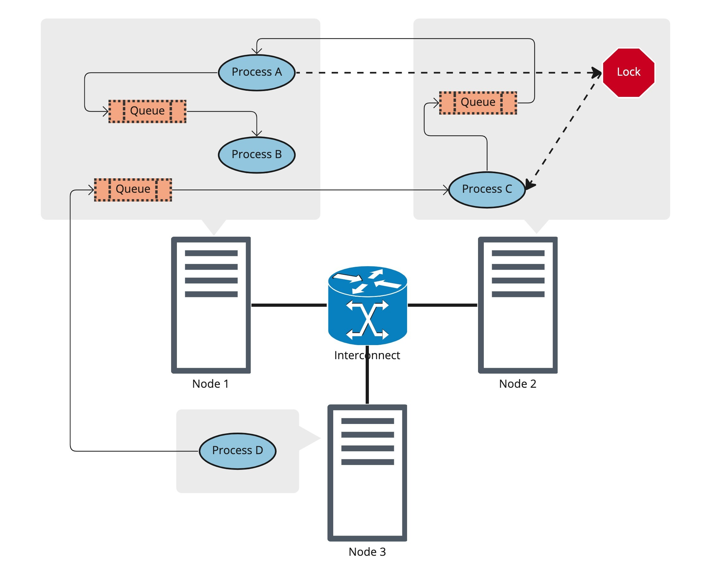

# Dragon

## Overview

> [!quote]+ HPE: Dragon
> Dragon is a composable distributed run-time for managing dynamic processes, high-performance communication objects, memory, and data at scale.
>
> This distribution package provides the necessary components to run the Python multiprocessing library using the Dragon implementation which provides **greater scaling and performance improvements** over the legacy multiprocessing that is currently distributed with Python.

- Dragon primitives run transparently in a distributed environment, abstracting away the details of the underlying distributed hardware
    - Done by implementing higher level abstractions over a low-level infrastructure that automatically handles off-node communication

## Take Aways

- Dragon is a modular runtime that makes distributed system programming much easier to do with great performance
    - Especially on HPC systems
    - Portability from laptop to HPC systems with little-to-no changes in code using `Dragon`
    - <mark class="blue">Will have an open-source implementation</mark>

- Implementing standard Python `multiprocessing` API over Dragon
    - Widely used and _standard_ Python API for parallel programming

- Many things can be implemented over Dragon
    - Parallel programming APIs for other languages
    - Tools, libraries, and applications
    - Entire workflows of serial and distributed applications

- Anything implemented over Dragon benefits from
    - Simpler to implement
    - Common and interoperable foundation
    - Consistent performance and scalability

## Requirements

- `python==3.9`
- GCC 9 or later
- Slurm (for multi-node Dragon)

## Setup
```Shell
$ python3 -m pip install --force-reinstall dragon-0.3-cp39-cp39-linux_x86_64.whl
$ export PATH="${HOME}/.local/bin:${PATH}"
$ module use [/path to dragon-0.3]/modulefiles
$ module load dragon
```
## Introduction

- **Goal: Create a common standard HPC interface**
    - Applications and workflows seamlessly port between platforms

- Program as you would on your local machine
    - No code changes necessary
    - _standard_ Python API
    - Extensible to other high-productivity languages

- Native distributed computing model
    - able to support sophisticated communication
    - enhance existing native multiprocessing
    - suitable for HPC implementations

- Run-time for launching and managing dynamic Python processes at scale
    - Time varying distribution of heterogeneous Python processes (+ other applications)

## Figure 1: Dragon Object Location Transparency

 - Process A is running on a different node than the queue it is receiving from.
 - At the same time, both A and B are sharing a queue on-node.
 - Process D is sending to a queue off-node
 - The transparency provided by Dragon means that the code in all these processes is **identical**
     - The code to receive off a remotely located queue is exactly the same as the code to receive off a locally located queue
     


## Running

1. Import Dragon and set dragon as the start method (similar to starting method for `spawn` or `fork`):
    ```python
    import dragon
    import multiprocessing as mp
    ...
    if __name__ == '__main__':
        # set the start method prior to using any multiprocessing methods
        mp.set_start_method('dragon')
        ...
    ```

    This must be done once for each application.

    Dragon is an API level replacement for multiprocessing, so to learn more about Dragon and what it can do, read up on [multiprocessing](https://docs.python.org/3/library/multiprocessing.html).

2. You must start your program using the `dragon` command. This not only starts your program, but it also starts the Dragon run-time services that provide the necessary infrastructure for running multiprocessing at scale.
    ```bash
    $ dragon myprog.py
    ```

## Comparison with  `multiprocessing`


| Msg len [B] | Dragon BW [MiB/s]   | Multiprocessing BW [MiB/s] |
|:----------- |:------------------- | -------------------------- |
| 2           | 0.16873165651944602 | 0.35729091529977935        |
| 4           | 0.3455474374498183  | 0.7198234652609471         |
| 8           | 0.6575456241988583  | 1.4375809198171736         |
| 16          | 1.4084134589051842  | 2.95214891823077           |
| 32          | 2.731188847666603   | 5.165766145143573          |
| 64          | 5.2671158930535285  | 11.661337219089496         |
| 128         | 11.088587526313056  | 23.43725450816791          |
| 256         | 20.76787931101707   | 31.071115656052463         |
| 512         | 45.3761153055356    | 84.60563976045968          |
| 1024        | 79.53386938294202   | 167.34126950882546         |
| 2048        | 156.52436347902236  | 308.02264787184595         |
| 4096        | 309.31890571446434  | 573.7437954450191          |


---

# Docs

<iframe
        border="0"
        frameborder="0"
        width=100%
        height="900px"
        src="file:///Users/saforem2/Downloads/dragon/_build/html/index.html">
</iframe>

---

# Slides

