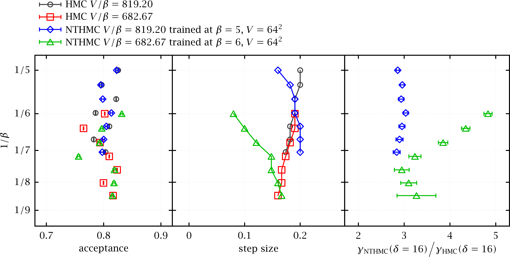

# HMC with machine learned acceleration

HMC [@Duane:1987de] is the standard method for generating lattice QCD gauge configurations. We will explore ways to accelerate the mixing of modes and exploration of different topological sectors within HMC using machine learning.

We are interested in evaluating multidimensional integrals of the form
$$\langle O \rangle = \frac{1}{Z} \int \mathop{\text{d}}\mathbf{x}~ O(\mathbf{x}) ~ e^{-S(\mathbf{x})},$$
with partition function $Z = \int \mathop{\text{d}\!}\mathbf{x}\, \exp[-S(\mathbf{x})]$, and $S(\mathbf{x})$ is the lattice action.

HMC samples the distribution $\exp[-S(\mathbf{x})]$ by adding a conjugate momentum for each variable, $\mathbf{p}$, and using molecular dynamics (MD) updates to generate Markov chain samples from the distribution.

The Hamiltonian for the system is $$\begin{aligned}
H(\mathbf{p},\mathbf{x}) = \frac12 \mathbf{p}^2 + S(\mathbf{x}).\end{aligned}$$

An HMC update step is given by

1.   Choose gaussian random $\mathbf{p}$

2.   Perform (approximate) MD evolution according to $H(\mathbf{p},\mathbf{x})$ for some time

3.   Accept the new configuration $(\mathbf{p}',\mathbf{x}')$ with probability 
    $$\begin{aligned} \min\left[1,e^{H(\mathbf{p},\mathbf{x})-H(\mathbf{p}',\mathbf{x}')}\right]\end{aligned}$$
    or, if rejected, keep original configuration $(\mathbf{p},\mathbf{x})$

The simplest example of an MD evolution step is the leapfrog algorithm (here written with momentum update first) algorithm
$$\begin{aligned}
\tilde{\mathbf{p}} &=& \mathbf{p}+ \frac{\epsilon}{2} F(\mathbf{x}) \\
\mathbf{x}' &=& \mathbf{x}+ \epsilon \tilde{\mathbf{p}} \\
\mathbf{p}' &=& \tilde{\mathbf{p}} + \frac{\epsilon}{2} F(\mathbf{x}')\end{aligned}$$

where $F(\mathbf{x}) = -\partial_{\mathbf{x}} S(\mathbf{x})$ is the force term. This approximates the MD evolution from $(\mathbf{p},\mathbf{x})$ to $(\mathbf{p}',\mathbf{x}')$ for a time step of size $\epsilon$. In practice many of these steps need to be put together to produce a total evolution time of order 1, while keeping the step size, $\epsilon$, small enough to retain accuracy.

This process can be accelerated in a number of ways by altering the dynamics used in the update steps. Here we outline two methods FTHMC and L2HMC.

## FTHMC

Acceptance rate, MD step size, and improvement in tunneling of topological charge with trained models of field transformation in 2D U(1) gauge theory with two fixed values of $V/\beta$ (constant physical volume), corresponding to $V=64^2$, $66^2$, $68^2$, $70^2$, $72^2$, $74^2$, and $76^2$. All Markov Chain uses proposal generated from MD evolution of 4 time units. NTHMC denotes FTHMC with neural network parameterized field transformation, using models trained at $\beta=5$ and $6$ with $V=64^2$. $\gamma$ is an estimator of the topological autocorrelation length from the autocorrelation function with separation of $\delta=16$ MD time units.

Following the arguments of "Trivializing maps" [@Luscher:2009eq], to evaluate ([\[obs\]](#obs){reference-type="ref" reference="obs"}) we
perform a change of variable, $$x = F(y)$$ with a vector function $F$, we have
$$⟨O⟩ = \frac{1}{Z} ∫ \mathop{\text{d}\!}y \left|\det[J(y)]\right| O\left(F(y)\right) e^{ -S\left(F(y)\right) },$$
with a Jacobian matrix 
$$J(y) = \frac{∂F(y)}{∂y}.$$
$F$ has to satisfy

-   Injective (1 to 1), from the new integration domain to the old,

-   Continuously differentiable (or differentiable and have continuous
    inverse).

This change of variables effectively leaves us with a transformed action
$$\begin{aligned}
S'(y) = S\left(F(y)\right) - \log \left|\det[J(y)]\right|\end{aligned}$$
defined in the transformed domain $y$. A smart choice of $F$ therefore has the potential of creating an effective action $S'(y)$ that is easier
to sample the problem domain than the  original action.

Given the typical tens of billions of degrees of freedom in lattice QCD and the highly nonlinear probability density of the lattice gauge configurations, finding an optimal transformation for given discretized MD update scheme can be difficult.

There is research on transformations for lattice gauge theories that try to create a simpler effective action. One example is constructing a trivializing map [@Luscher:2009eq] (also cite Nobu?) based on perturbation theory, which trivializes the action, $S'(y) \sim \mathrm{constant}$. Another example is using deep neural networks to build a normalizing flow [@Kanwar:2020xzo], such that $S'(y) \sim \frac12 y^2$. In practice such transformation may be difficult to achieve exactly, so typically one needs to account for this by embedding the transformation in a Metropolis-Hastings algorithm or HMC.

We plan to use HMC for sampling in the transformed domain $y$ according to the effective transformed action $S'(y)$. Here we are interested in building the transformation optimized for the computational cost of generating independent gauge configurations. Such transformations will be parameterized by a few parameters [@Luscher:2009eq] (and Nobu), or will be generalized by neural networks [@Foreman:2021ljl; @Jin:2022bgq], where we employed gauge covariant neural networks.

We optimize the transformations using the K-L divergence [@Foreman:2021ljl], or the MD force of the effective action [@Jin:2022bgq]. Training on the force with a neural network parameterized transformation not only decreases the integrated autocorrelation time, it also decreases the number of force evaluations required in the MD evolution of HMC, shown in
figure 
[1](#fig:nthmc_stepsize_fixBV){reference-type="ref" reference="fig:nthmc_stepsize_fixBV"}
as a test for 2D U(1) gauge
theory, all with a fixed trajectory length of 4 MDTU. The right panel of
figure 
[1](#fig:nthmc_stepsize_fixBV){reference-type="ref" reference="fig:nthmc_stepsize_fixBV"}
shows the ratio of the inverse of the deviation of the autocorrelation away from one,

$$\gamma(\delta) = \frac{1}{1-\Gamma_t(\delta)} \mathpalette%
  \mathrel{%
    \setbox 0=\hbox{$\relax\sim$}%
    \setbox 2=\hbox{%
      \rlap{\hbox{$\relax\propto$}}%
      \lower 1.1\ht 0\box 0%
    }%
    \raise 0.25\ht 2\box 2%
  }%
_{\text{int}}.$$

which is approximately proportional to the integrated autocorrelation length, where $\Gamma_t(\delta)$ denotes the autocorrelation function of the Markov chain for a separation of $\delta$ MD time units. We use $\gamma(\delta=16)$ to estimate the relative independence of the generated lattice configurations.

Here are the plans specifically for FTHMC with neural network paremeterized transformations.

-   Research physics informed neural network architectures that facilitate transformations of lattice gauge fields.

-   Research effective loss functions that take into account not only the decorrelation of the Markov Chain but also the overall computational cost.

-   Research the effects of the fermionic action within the FTHMC framework, optimize field transformations that effectively lower the costs of fermions.

## L2HMC

An alternative to performing a change of variables in the HMC procedure is to directly modify the MD update scheme. We can generalize the leapfrog step in the HMC update by introducing functions $\Gamma, \Lambda$ which update the momentum and position, respectively.
These functions incorporate neural networks with parameters that need to be trained. 
Since this update is no longer symplectic, we must now include a Jacobian factor in the final accept/reject step.
To ensure that the Jacobian is efficiently computable, we split the $\mathbf{x}$ update into two parts and sequentially update complementary subsets
using a binary mask $m$ and its complement $\bar{m} = 1-m$.

Explicitly, we can write this series of updates as:
$$\begin{aligned}
 \tilde{\mathbf{p}} &\gets& \Gamma_1(\mathbf{x}, \mathbf{p}) \\
 \tilde{\mathbf{x}} &\gets& m \odot \mathbf{x}
  + \bar{m} \odot \Lambda_1(\mathbf{x}_{\bar{m}},  \tilde{\mathbf{p}}) \\
 \mathbf{x}' &\gets& \bar{m} \odot \tilde{\mathbf{x}} 
  + m \odot \Lambda_1(\tilde{\mathbf{x}}_{m}, \tilde{\mathbf{p}}) \\
 \mathbf{p}' &\gets& \Gamma_2(\mathbf{x}', \tilde{\mathbf{p}})  ~.\end{aligned}$$
 
The above step can be repeated $N_{LF}$ times, each time with a different set of network parameters. Reversibility of the update can be ensured by including an update which performs the full set of update steps in reverse.
This can either be done by choosing at random to perform a forward or backward update procedure, or by always including the full set of backwards updates after the set of forward updates.
If we denote our complete state by $\xi = (\mathbf{x}, \mathbf{p})$, we can write the acceptance probability as
$$A(\mathbf{x}'|\mathbf{x}) = \min\left\{1, \mathcal{J}(\xi', \xi)\cdot e^{H - H'}\right\}.$$
which now includes a Jacobian factor $\mathcal{J}(\xi', \xi)$.
The update functions $\Gamma, \Lambda$ are parameterized by weights $\theta$ in a neural network which can be optimized by maximizing a suitably
chosen loss function $\mathcal{L}_{\theta}(\mathbf{x}, \mathbf{x}')$.

This method has been successfully applied to a 2D $U(1)$ lattice gauge theory [@Foreman:2021rhs], as measured by the improvement in the integrated autocorrelation time of the topological charge, shown in Fig [2](#fig:autocorr){reference-type="ref" reference="fig:autocorr"}.

Here the loss function is based on the change in a continuous version of the topological charge.
Currently, our approach uses fully connected normalizing flows as the base architecture for the update functions, but in principle this method should stand to benefit from incorporating additional physical symmetries into the model.

![[\[fig:autocorr\]]{#fig:autocorr label="fig:autocorr"}Illustration of
the improvement in the integrated autocorrelation time for L2HMC vs
generic HMC on a $V=16^2$ 2D U(1) gauge
theory.](autocorr_vs_beta.pdf){#fig:autocorr width="0.5\\linewidth"}

# Work plan

This work plan focuses on applying ML to HMC via FTHMC and L2HMC methods. There are many overlaps with the other work plans on HMC methods that represent areas for collaboration.

A rough outline of activities for both methods might be:

-   Implement simple version of model for 4d SU(3) pure-gauge

-   Explore methods for improving training time including transferring model from smaller lattice or different beta, simplifying models, introducing model-parallelism, and code optimization (possibly calling optimized C++ routines)

-   Explore ways to improve effectiveness of trained model including developing new network layers, optimizing placement of layers, hyperparameter tuning, and choice of loss function 

-   Investigate benefits of domain decomposition (DD) to preserve locality in the networks. Compare effectiveness of DD methods with other global methods.

-   Introduce fermions into simulation either as modification to the network or as modification of the HMC process independent of the network. Compare merits of both approaches.

We would also compare the training time and effectiveness of FTHMC and L2HMC, and try to determine the advantages of each method. We may also try combining them, for example performing L2HMC evolution of a field-transformed action.

Much of the research plan has potential connections to ASCR research, including existing interests within the SciDAC institutes.

-   **Model parallelism**: Developing efficient parallel models and training methods will be necessary for testing larger lattices. One approach is to look into using existing model-parallel Python frameworks such as Colossal-AI (https://www.colossalai.org/), DeepSpeed (https://www.deepspeed.ai) and LBANN (https://lbann.readthedocs.io/en/latest/index.html). These could be useful for quickly testing ideas on larger lattices. In addition to training a single model on the whole lattice, we could also try training a network model on smaller sublattices. This model can then be repeated to form larger lattices. The relative efficiency in training and inference of a full lattice model versus sublattice models can be compared. Shinjae is also interested in this area.
    \[*need to add references*\]

-   **(Hyper-)Parameter optimization**: Optimizing model hyperparameters will be one area of exploration. This could be done by using DeepHyper (https://deephyper.readthedocs.io/en/latest). Prasanna could be a contact for this. We may also try treating some model parameters as hyperparameters so they can be trained without the
    need for calculating gradients, which could simplify the implementation of some networks. There may be other opportunities for optimization such as trying to learn a better annealing schedule for training.

-   **Symmetry preserving networks**: We will explore the various options for exploiting lattice gauge invariance in the networks. This can be done by explicitly constructing the ML models to be gauge covariant. Another approach is to not require covariance in the network, and instead augment the training data with rotated copies of the data to try to train the network in a covariant way. This may allow more flexibility in designing the networks, and is a popular area for ML research \[*need references*\]. A third approach is to do deterministic gauge fixing before and after evaluating each network function. The differences between these methods can be compared.

-   **Integrating ML frameworks with application code**: We will work on integration of Python ML frameworks with optimized LQCD codes. This will be necessary when dealing with fermions in Python to have access to optimized solvers, and could also be useful for other kernels such as the action calculation and force terms. This will also require matching the data and model-parallel workflow in Python with that of the LQCD codes.

#### Effort

Current thoughts on effort

-   Xiao-Yong  (70%)
 
-   Sam  (25%)

-   James (5%)

-   Other RAPIDS effort

# Miscellaneous notes

## Relation of FTHMC to RMHMC

Consider a change of variable for $π$ and $y$, $$\begin{aligned}
    π &= J(y) p = J\left(F⁻¹(x)\right) p, \\
    y &= F⁻¹(x),\end{aligned}$$ with the Jacobian matrix of determinant $1$,
$$\begin{aligned}
    \mathcal{J}(p,x) &=
        \begin{bmatrix}
        J\left(F⁻¹(x)\right) & \frac{∂}{∂x} J\left(F⁻¹(x)\right) p \\
        0 & \frac{∂}{∂x} F⁻¹(x)
        \end{bmatrix}, \\
    \det[\mathcal{J}] &= 1.\end{aligned}$$ We get a new Hamiltonian
$$\tilde{ℋ}(x,p) = ½ p^† M p + S(x) - \ln\left|\det[J]\right|$$
where the positive definite M,
$$M(x) = J^†\left(F⁻¹(x)\right) J\left(F⁻¹(x)\right)$$ is the kernel of the kinetic term considered Duane et al [@Duane:1986fy; @Duane:1988vr].

## L2HMC details

### Training Step

1.  Resample $\mathbf{p}\sim \mathcal{N}(0, \mathbb{1})$, $d \sim \mathcal{U}(+,-)$, and construct initial state $\xi = (\mathbf{x}, \mathbf{p}, \pm)$ 
2.  Generate proposal configuration $\xi'$ by passing the initial state sequentially through $N_{\mathrm{LF}}$ *leapfrog layers*: $\xi\rightarrow \xi_{1}\rightarrow \cdots\rightarrow \xi_{N_{\mathrm{LF}}} = \xi'$ 
3.  Compute the Metropolis-Hastings acceptance $A(\xi'|\xi) = \min\{1, \mathcal{J}(\xi',\xi) e^{H-H'}\}$ 
4.  Evaluate the loss function $\mathcal{L}_{\theta}(\mathbf{x}',\mathbf{x})$ and back-propagate gradients to update weights 
5.  Evaluate the Metropolis-Hastings criteria and assign the next state in the chain according to $\mathbf{x}_{t+1} \leftarrow \begin{cases}%
            \mathbf{x}^{\ast} \text{ with prob. } A(\xi^{\ast}|\xi) \\
            \mathbf{x}\text{ with prob. } 1 - A(\xi^{\ast}|\xi)
        \end{cases}$

### Annealing Schedule

As an additional tool to help improve the quality of the trained sampler, we can scale the action during the $N_{T}$ training steps using the target distribution $p_{t}(x)\propto e^{-\gamma_{t}S(x)}$ for $t = 0, 1, \ldots, N_{T}.$ The scale factors, $\gamma_{t}$, monotonically increase according to an *annealing schedule* up to $\gamma_{N_{T}} = 1$, with $|\gamma_{i+1} - \gamma_{i}| \ll 1$. For $\gamma_{i} < 1$, this helps to re-scale (shrink) the energy barriers between isolated modes, allowing the training to experience sufficient tunneling even when the final distribution is difficult to sample.

## Relation of L2HMC to (generative) FTHMC

The original L2HMC method includes an Auxiliary Loss Term which helps train on reducing the burn-in time. Currently, A single training step of the L2HMC approach takes as input $x$

1.  Generate proposal $x'$ by passing $x$ through L2HMC dynamics

2.  Evaluate loss

3.  Accept / reject, $A(x'|x)$

4.  Backpropagate

5.  Send accepted configurations $x' \cdot A(x'|x)$ back in as input

The loss function used to train the L2HMC sampler is currently some
$$\mathcal{L}_{\theta}(x, x') = A(x'|x)\left[ w_{q}\cdot \ell_{q}(x, x') + w_{p}\cdot \ell_{p}(x, x')\right]
    %A(x'|x)\left[a_{Q}\cdot\left(Q' - Q\right)^{2} + a_{P}\cdot  (1 - 2\cos{(x'-x)})\right]$$
where $x'$ is the proposal configuration generated from the L2HMC
dynamics $\ell_{p}$, $\ell_{q}$ are plaquette and charge loss terms, and
$w_{q}$ and $w_{p}$ are scalar multiplying factors to control the
relative contributions. The accepted configurations are then fed back
through the L2HMC dynamics to generate another proposal configuration.
We can accumulate additional gradients by passing some
$y \sim \mathcal{U(-\pi,\pi)}$ through the dynamics so that the total
loss is then
$$\sum\mathcal{L}_{\theta} = w_{x}\cdot \mathcal{L}_{\theta}(x, x') + w_{y}\cdot \mathcal{L}_{\theta}(y, y')$$
If each of these weights $w_i$ are identically $0$ we recover generic
HMC.

Alternatively, if we ignore the sequential sampling component and
consider a single training step consisting of:

-   Draw $y \sim \mathcal{U}(-\pi, \pi)$,

-   Draw momentum $v \sim \mathcal{N}(0, \mathbb{1})$

-   Generate a batch of outputs by passing $(y, v)$ through the L2HMC
    network

-   Minimize KL-divergence between this proposal distribution and the
    target

If we neglect the momentum and instead just pass $y$ through the L2HMC
network, we recover the FTHMC training step?
