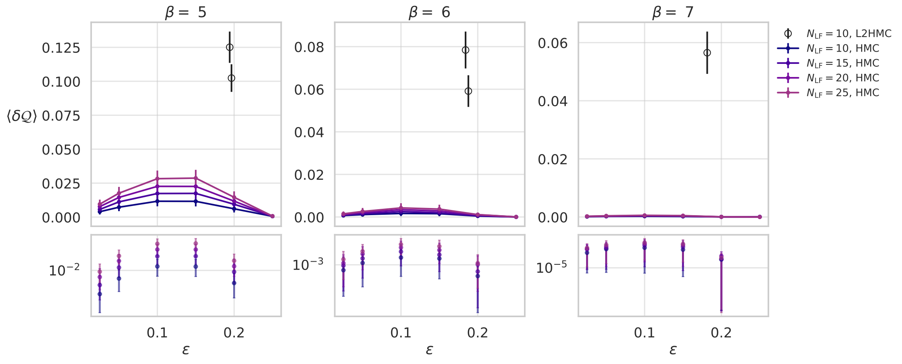
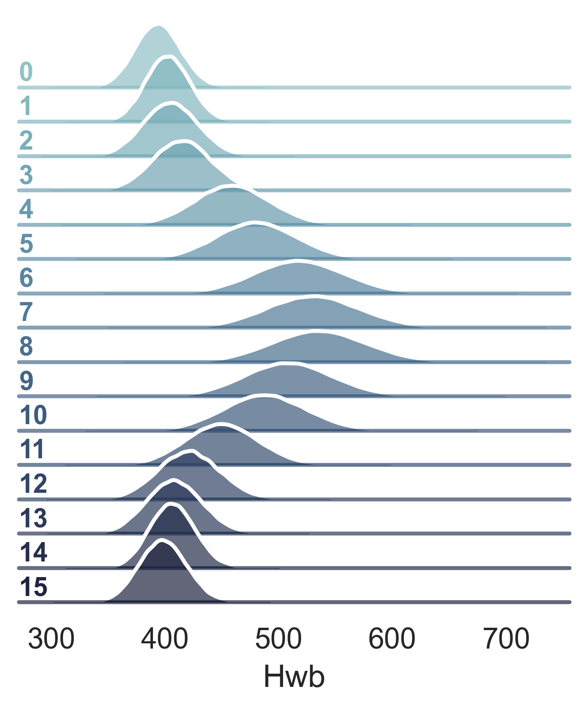
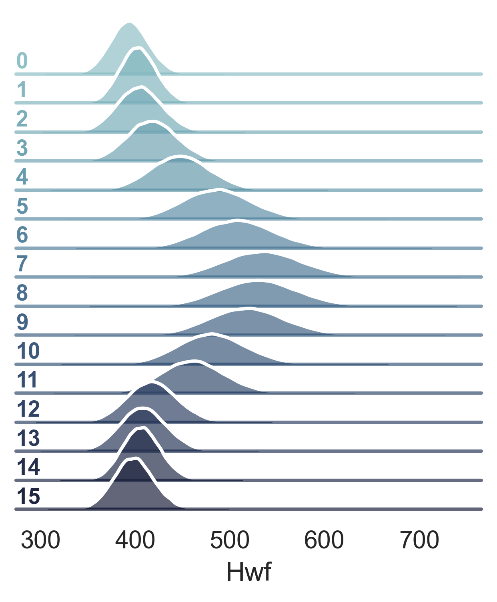
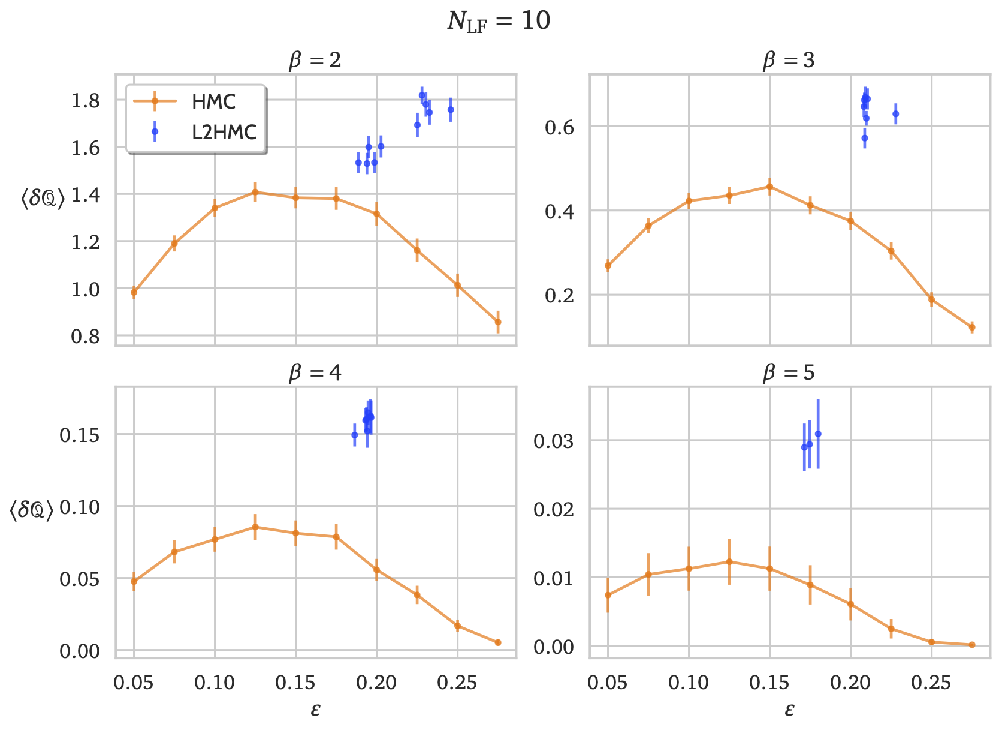
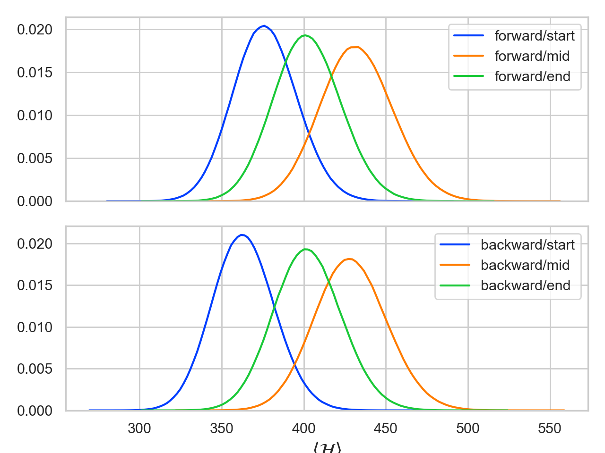
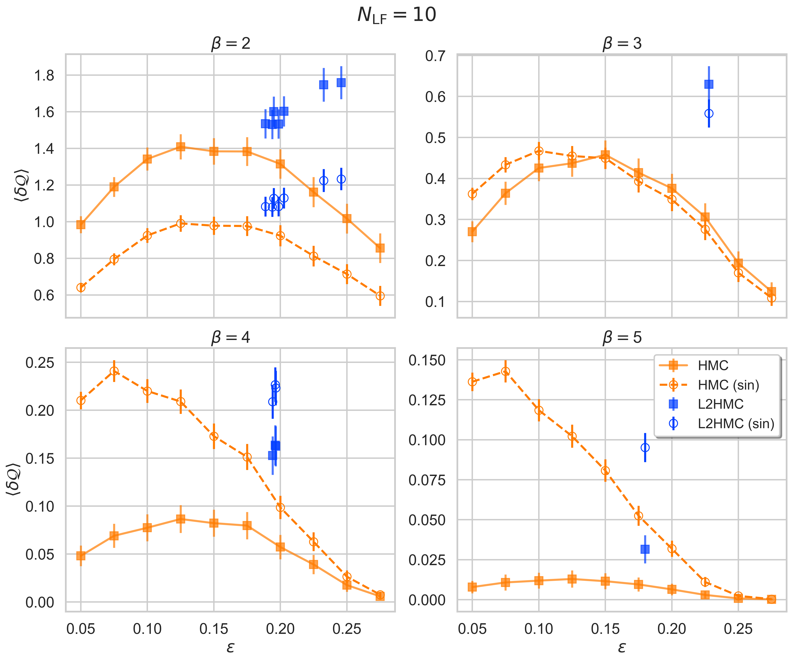
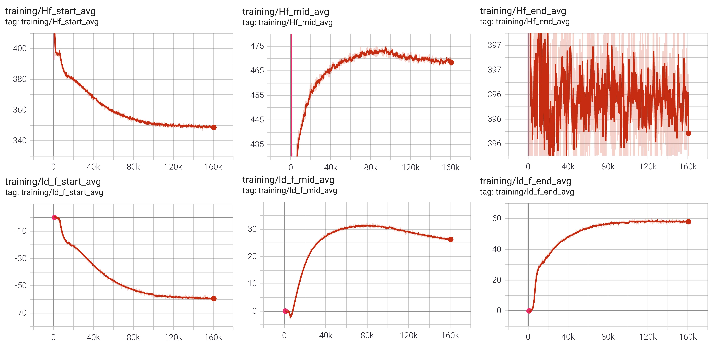
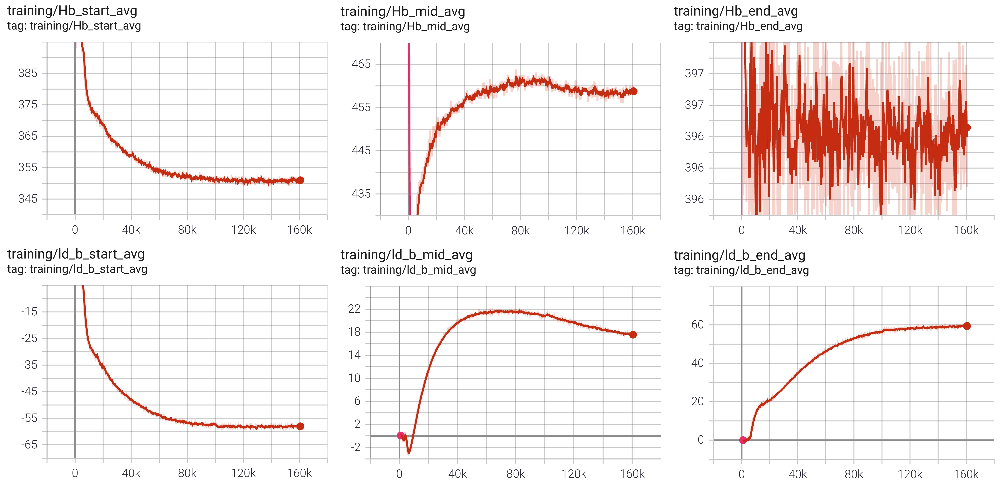

# 2020

2020/12/11:
===========
**TODO:**

- [ ] Use separate networks for first (+ last) half-momentum update(s), $`v(t) \rightarrow v(t+\varepsilon/2)`$
- [ ] Use separate networks for each of the two $`x`$ sub-updates
- [ ] Try using a unique (trainable) step-size $`\varepsilon`$ for each term (in both $`x`$ and $`v`$ updates)
- [ ] Look at the contribution of each of the $`S_{i}, T_{i}, Q_{i}`$ terms by turning them on/off during inference.
- [ ] See if the energy increase towards the middle of the trajectory saturates with more leapfrog steps.
- [ ] Calculate $`\tau_{\mathrm{int}}`$ for $`\mathcal{Q}`$
- [ ] Calculate $`W_{\ell\times\ell}`$ for $`\ell = 4, 5, 6`$, Polyakov loop, remainder of observables from [Equivariant Flow Based Sampling for Lattice Gauge Theory](https://arxiv.org/abs/2003.06413)

---
**Recent progress:**
* Longer annealing schedule with well-tuned dynamic learning rate schedule, starting from $`\beta = 4 \rightarrow 5`$ ($`5e5`$ training steps) gives noticeable improvements.
  - This improvement is sustained for $`\beta = 5 \rightarrow 6`$ and $`\beta = 6 \rightarrow 7`$ by using the same 
    network, and restarting the learning rate at $`\alpha = 4e-3`$, with an identical annealing schedule.

* Currently working on testing using different step sizes for each leapfrog step in the trajectory

```math
\varepsilon \rightarrow \vec{\varepsilon} = [\varepsilon_{1}, \ldots, \varepsilon_{N_{\mathrm{LF}}}]
```






2020/11/20:
===========

* Keep pushing towards larger $`\beta = 5, 6`$

* Ensure results are consistent for $`N_{\mathrm{LF}} = 10, 15, 20`$ at $`\beta = 4.5, 5, \ldots`$

* Work on pyTorch implementation for SambaNova

* Update HMC results with $`N_{\mathrm{LF}} = 15, 20, 30(?)`$

* Think of / work on ways to incorporate symmetry into network / loss function

  - Look at using "checkerboard" masks for convolutional layer x-updates

  - Try "collapsing" masks for convolutional layer x-updates


* Is it consistent that increasing $`N_{\mathrm{LF}}`$ doesn't improve the quality of the trained sampler?

  - Seems that $`N_{\mathrm{LF}} = 15, 20`$ perform similarly at $`\beta = 4.5`$, also true at $`\beta = 5`$?


2020/11/13:
===========

- Look at using "checkerboard" masks for convolutional layer x-updates

- Look at "collapsing" the zeroed-out links and pass the "collapsed" lattice to the convolutional layer

- If computationally feasible, try increasing the number of leapfrog steps even further
  $`N_{\mathrm{LF}} = 20, \ldots, 40`$?

- Try getting good results up to $`\beta = 6`$

- Updated tunneling rate plots:



2020/10/16:
===========

Energies during trajectory:



2020/10/09:
===========

**New preprint**: [A Neural Network MCMC Sampler that Maximizes Proposal Entropy](https://arxiv.org/pdf/2010.03587.pdf)


### Tunneling rate plots:

Updated tunneling rate plots with new L2HMC (inference) data at $`\beta = 2, 3, 4, 5`$ with $`N_{\mathrm{LF}} = 10`$ leapfrog steps.


-----

### Energy and Logdet during trajectory:

Additionally, we can look at how the energy and the log determinant vary over a single trajectory.   
Included below are plots of the average energy and logdet at the beginning, middle, and end of a single trajectory plotted separately for both the forward and backward directions.

- **NOTE:** We see that the energy at the midpoints `Hf_mid_avg` and `Hb_mid_avg` is greater than it is at either of the two endpoints, similar to what we would expect from a "tempered"[[1]](https://arxiv.org/abs/1206.1901) trajectory.


- **Forward:**


- **Backward:**


2020/10/02:
============

Drop t if using separate networks ($`t \rightarrow 0`$)

Run inference on models showing improvement and plot the
topologies (explicitly) to compare tunneling rates

Look at how the total energy varies over a trajectory
  - If the model learns to "temper"[[1]](https://arxiv.org/abs/1206.1901) 
    the trajectory, should see the energy increase in the first half before
    decreasing (back to original value) in the second half.


If chains are clearly stuck during training, try annealing from $`\beta_{0} \le \beta`$ 
  - Chains seem to get stuck somewhere around $`\beta \simeq 4`$


2020/9/25:
==========
- Write notes on explicit updates with separate networks

- Try combining second (half-step) momentum update with first (half-step) momentum update in inner leapfrog steps

- Try single combining forward / backward updates by:
   1. Forward update (Eq's. 17-20)
   2. Reverse momentum: $`v \rightarrow -v`$
   3. Backward update (Eq's 21-24)


2020/9/11:
==========

Trying Tempering during a trajectory from [MCMC using Hamiltonian dynamics (Neel)](https://arxiv.org/abs/1206.1901)

[Involutive MCMC: a Unifying Framework](https://arxiv.org/abs/2006.16653)

Try explicit Forward(F) & Backward(B) update step
- for n steps, could do $`F^n B^n(\xi)`$ as full update step

Make network deeper (more independent network update steps)?
- i.e. $`F_{1} F_{2} F_{3} \ldots B_{3} B_{2} B_{1}(\xi)`$


2020/8/28:
==========

separate even/odd update networks
- check for improvement

check non-compact updates

2020/8/14:
=========

split even/odd update networks
- index active sites on input to network

2020/8/7:
=========

Tried noncompact update, giving incorrect plaquette.

Start doing careful comparison of HMC and L2HMC:
- collect HMC results for different beta (1,2,3) and # leapfrog steps (4, 8, 12)
- tune stepsize to find best tunneling rate for HMC
- try L2HMC (compact) runs at same beta and leapfrog steps
- compare results directly between corresponding HMC and L2HMC results

Fix noncompact update.  Check reversibility.

2020/7/31:
==========
beta=3
- thermalizes quickly, loss doesn't improve over HMC
- qloss, acceptance and tunneling rate don't seem consistent when comparing HMC an L2HMC
- maybe sin tunneling rate isn't well correlated with full tunneling rate?
- compare both during training & inference

beta=1 tunneling rate improves during training

modify loss function?


2020/7/24:
==========

MD seems to remove bias.

Monitor during training/inference (same values during training and inference):
- topo loss = acceptance * (diff sum sin_topo)^2
- plaq loss = acceptance * sum 2*[1-cos diff plaq]
- full loss (if different from above)
- acceptance
- sin tunneling rate = (diff sum sin_topo)^2
- tunneling rate = |diff sum topo|

Training after MD seemed to give lower loss function.
- check if reproducible
- see why lower (acceptance, tunneling)
- see if results at end of training are consistent with inference from random start

2020/7/17:
==========

- Run MD (no accept/reject) for initial set of trajectories to avoid getting stuck
- Check that no runs in batch are getting stuck
- Check that plaq error is small
- Try training at beta=2 for a while, then switch to beta=3; compare to training at just beta=3

2020/7/10:
==========

- Find out why loss increases
- Train at fixed beta and determine when loss stops decreasing
- Modify network (depth?) and compare loss, fixing all other run parameters
- Save configurations on each rank when saving checkpoints


2020/7/2:
=========

Monitor during training/inference:
- topo loss
- plaq loss
- full loss (if different from above)
- acceptance
- tunneling rate

Get HMC results with above for varying step size


2020/6/26:
==========

Try adding back in S_x
