# 2021-07-23:

## Leapfrog Tests

<p align="center" width="100%">
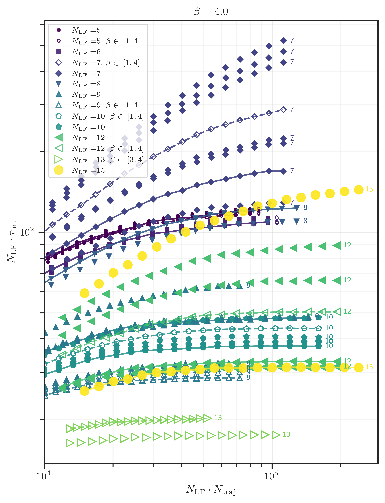
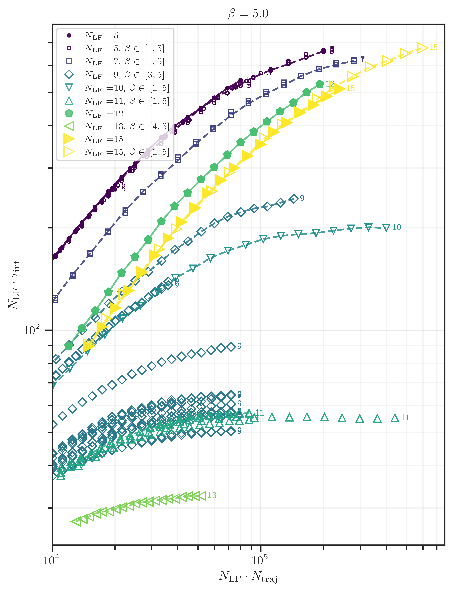
</p>

## Updated LeapfrogLayer diagram

<p align="center" width="100%">
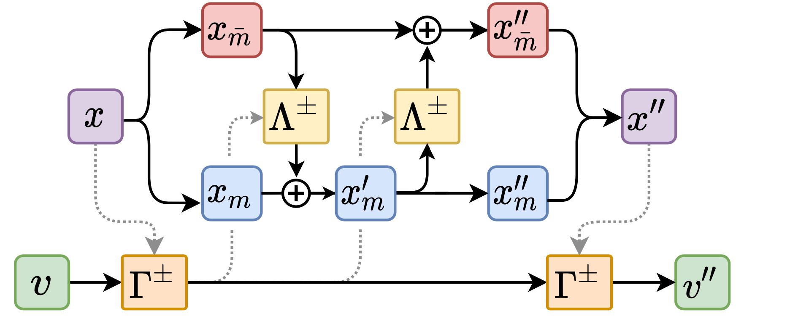
</p>

# 2021-07-16:

## Leapfrog Tests

<p align="center" width="100%">
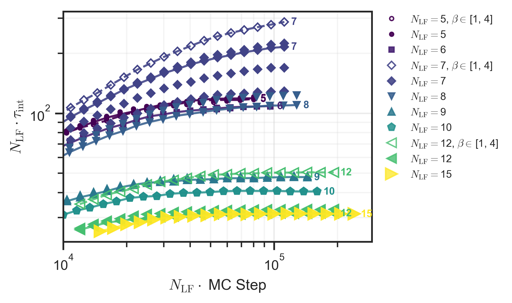
</p>

# 2021/06/04:

## Leapfrog Tests

- $`N_{\mathrm{LF}} = 5`$, $`\beta: 1\rightarrow 5`$, $`N_{\mathrm{train}} = 1\times 10^5`$, `net_weights = (1, 1, 1, 1, 1, 1)`, :

<p align="center" width="100%">
  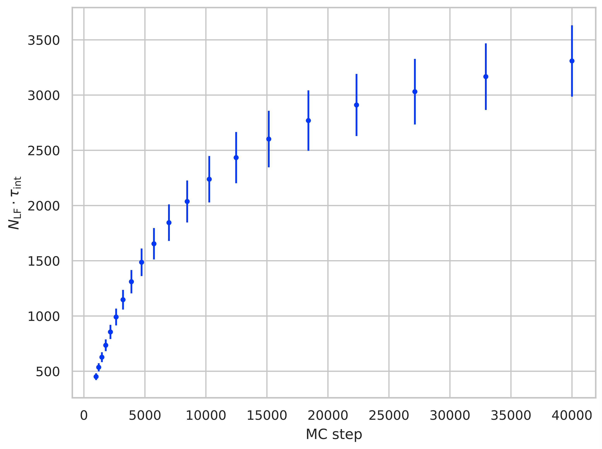
</p>

- $`N_{\mathrm{LF}} = 5`$, $`\beta: 1\rightarrow 5`$, $`N_{\mathrm{train}} = 1\times 10^5`$, `net_weights = (0, 1, 1, 0, 1, 1)`, :

<p align="center" width="100%">
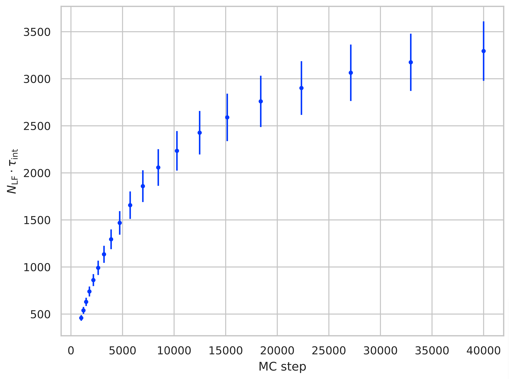
</p>

- $`N_{\mathrm{LF}} = 5`$, $`\beta: 3\rightarrow 5`$, $`N_{\mathrm{train}} = 1\times 10^5`$, `net_weights = (1, 1, 1, 1, 1, 1)`, :

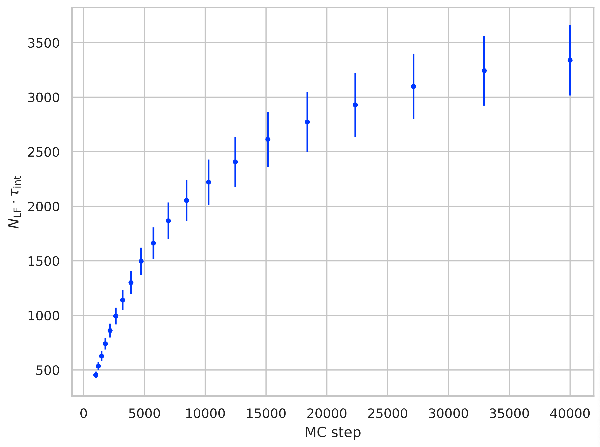

- $`N_{\mathrm{LF}} = 7`$, $`\beta: 1\rightarrow 5`$, $`N_{\mathrm{train}} = 1\times 10^5`$, `net_weights = (1, 1, 1, 1, 1, 1)`, :

<p align="center" width="100%">
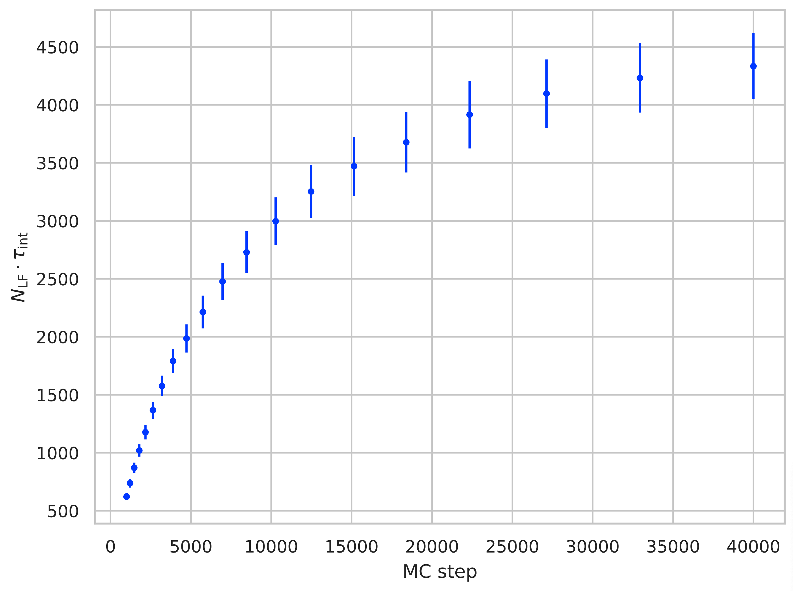
</p>

- $`N_{\mathrm{LF}} = 9`$, $`\beta: 1\rightarrow 5`$, $`N_{\mathrm{train}} = 5\times 10^5`$, `net_weights = (1, 1, 1, 1, 1, 1)`, :

<p align="center" width="100%">
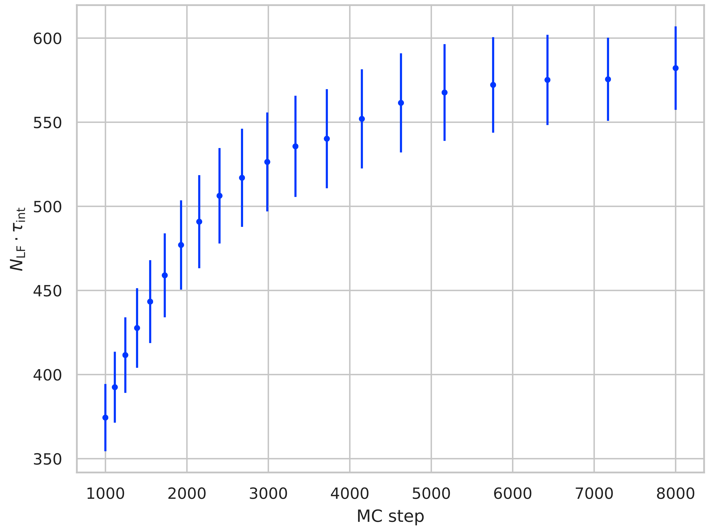
</p>

- $`N_{\mathrm{LF}} = 10`$, $`\beta: 1\rightarrow 5`$, $`N_{\mathrm{train}} = 1\times 10^5`$, `net_weights = (1, 1, 1, 1, 1, 1)`, :

<p align="center" width="100%">
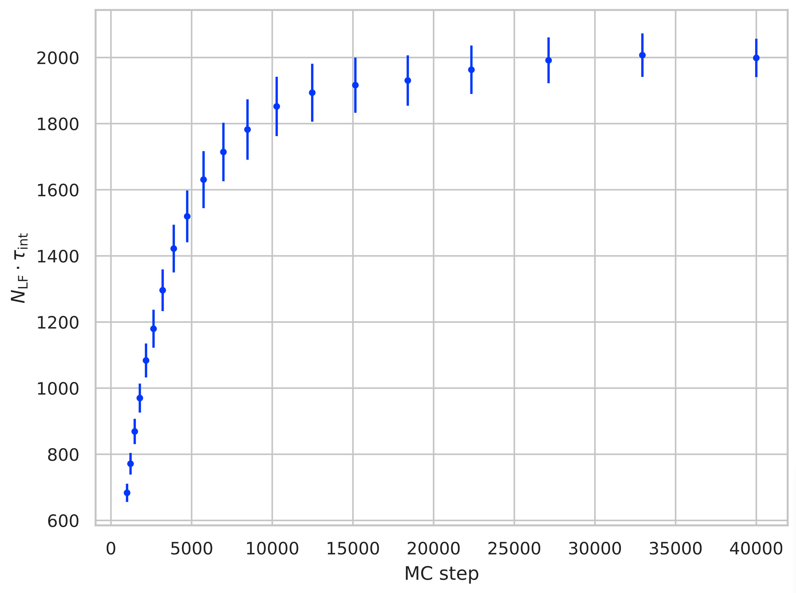
</p>

- $`N_{\mathrm{LF}}=15 `$: _in progress_

---

## Topological Susceptibility
- Semiclassical approximation:
```math
Z^{U(1)}\simeq (2\pi\beta)^{-N_{s}N_{t}/2}\sum_{n=-\infty}^{+\infty}\left(e^{-\frac{n^{2}}{2\beta}}\right)^{N_{s}N_{t}}
```

The topological susceptibility is defined as [1]
```math
\chi = -\frac{d^{2}}{d\theta^{2}}\ln(Z)|_{\theta=0}
```

It can be calculated using the exact resummation
```math
Z(\beta,\theta) = \sum_{-\infty}^{\infty}\left[e^{-\beta} I_{n}\left(\sqrt{\beta^{2}-\left(\frac{\theta}{2\pi}\right)^{2}}\right)\times
\left(\frac{\beta-\theta\,/\,2\pi}{\beta+\theta\,/\,2\pi}\right)^{\frac{n}{2}}\right]^{N_{s}N_{t}}
```

If $`\chi`$ is dominated by configurations corresponding to winding number $`\pm 1`$ where $`|Q|\simeq 1`$ in the continuum limit, we have the large $`\beta`$ estimate

```math
\chi \simeq (0)^{2}\cdot 1 + (1)^{2}\exp\left(-\frac{\beta}{2}\frac{(2\pi)^{2}(1)^{2}}{N_{s}N_{t}}\right)
+ (-1)^{2}\exp\left(\frac{(2\pi)^{2}}{N_{s}N_{t}}(-1)^{2}\right)
```

From: [arXiv:2003.10986](https://arxiv.org/pdf/2003.10986.pdf)

<p align="center" width="100%">
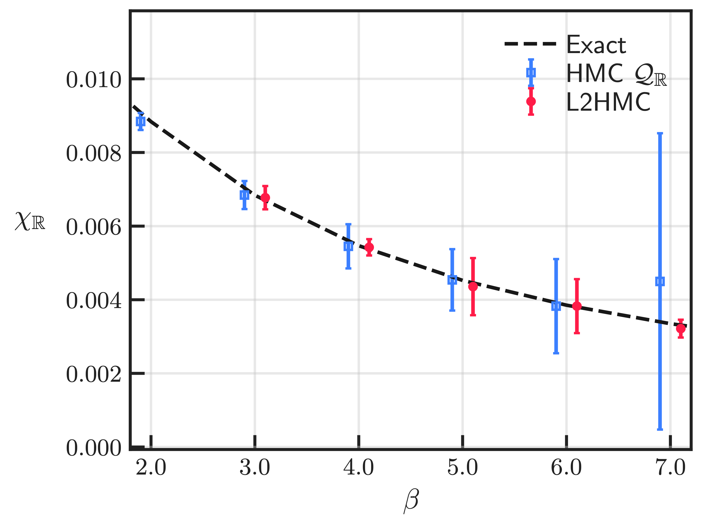
</p>

---

- Working on `pytorch` implementation
  - `Dynamics` + `LeapfrogLayers` (network) seem to be working correctly, but encountering the following error in the `train_step` function. Seems like its being caused by a tensor being modified inplace but I can't seem to figure out where...   
     >`RuntimeError: one of the variables needed for gradient computation has been modified by an inplace operation: [torch.FloatTensor [8, 512]], which is output 0 of TBackward, is at version 8; expected version 7 instead. Hint: the backtrace further above shows the operation that failed to compute its gradient. The variable in question was changed in there or anywhere later. Good luck!`

---

# 2021/05/20:

* Working on running a collection of (reproducible) experiments in order to:
  - Try and reduce training cost and
  - Better understand importance of $`S_x`$, $`S_v`$ terms
* Re-scaled `x-axis` by $`N_{\mathrm{LF}}`$ in autocorrelation plots for better comparison across different trajectory lengths
  - Rename `x-axis` to `gradient evaluations`?

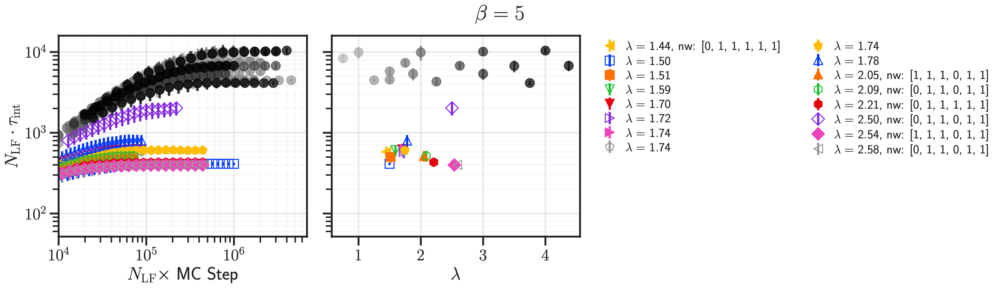
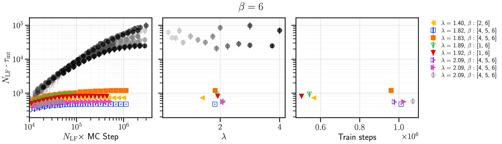
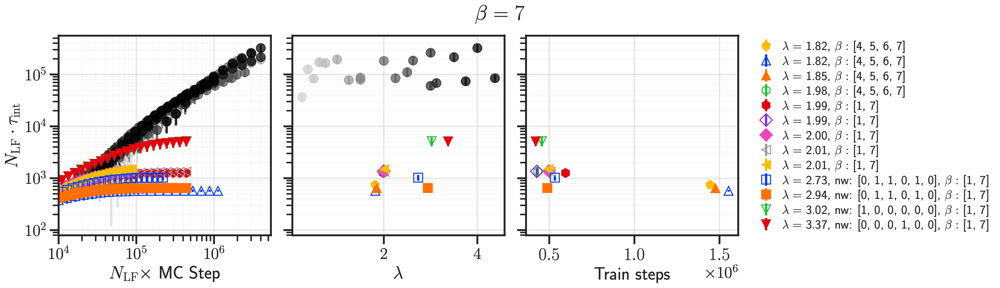


* Working on re-running inference with previously trained models to generate data for $`Q_{\mathrm{sin}}`$ to calculate $`\chi`$ and compare with semi-classical approximation from Yannick's results on 
> ["Discrete aspects of continuous symmetries in the tensorial formulation of Abelian gauge theories"](https://arxiv.org/abs/2003.10986)

<p align="center" width="100%">
  
</p>

<p align="center" width="100%">
  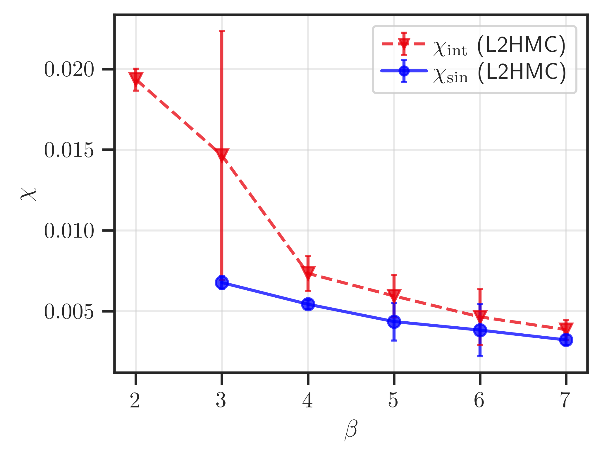
</p>

---

# 2021/05/14:

1. Updated [overleaf draft](https://www.overleaf.com/project/5ffa24db01cc644c9606eb08)
2. Updated $`N_{\mathrm{LF}}\cdot \tau_{\mathrm{int}}`$ plots to show $`N_{\mathrm{train}}`$
3. Working on re-running inference on trained models to get statistics about $`\mathcal{Q}_{\mathbb{R}}`$ in order to compute $`\chi_{\mathcal{Q}_{\mathbb{R}}}`$ and compare against predicted values from Yannick [https://journals.aps.org/prd/pdf/10.1103/PhysRevD.102.014506](https://journals.aps.org/prd/pdf/10.1103/PhysRevD.102.014506)

- Updated plots:
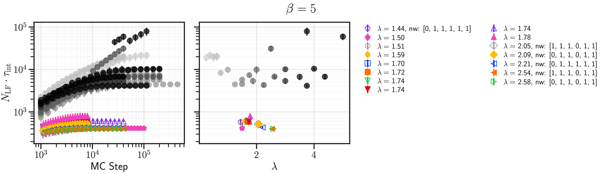

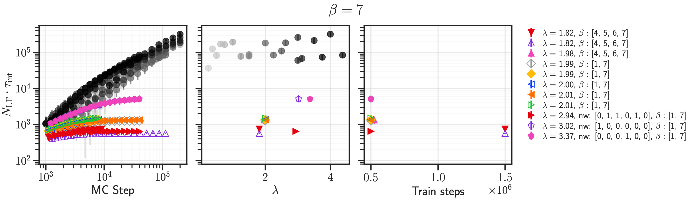

---

2021/01/08:
============
**TODO** (from 2020/12/11):
- [ ] Work on draft [overleaf](https://www.overleaf.com/9563978224cnctgxpwgwzm), 
      [github](https://github.com/saforem2/l2hmc_draft)
- [ ] Look at the contribution of each of the $`S_{i}, T_{i}, Q_{i}`$ terms by turning them on/off during inference.
- [ ] Calculate $`W_{\ell\times\ell}`$ for $`\ell = 4, 5, 6`$, Polyakov loop, remainder of observables from 
      [Equivariant Flow Based Sampling for Lattice Gauge Theory](https://arxiv.org/abs/2003.06413)
- [ ] See if the energy increase towards the middle of the trajectory saturates with more leapfrog steps.

**NOTE:** Qualitatively, it seems like increasing $`N_{\mathrm{lf}}`$ causes an increase in the energy towards the middle of the trajectory, but it is not clear that this translates to an improvement in the tunneling rate.

**Completed:**
- [x] Use separate networks for first (+ last) half-momentum update(s), $`v(t) \rightarrow v(t+\varepsilon/2)`$
- [x] Use separate networks for each of the two $`x`$ sub-updates
- [x] Try using a unique (trainable) step-size $`\varepsilon`$ for each term (in both $`x`$ and $`v`$ updates)
- [x] Calculate $`\tau_{\mathrm{int}}`$ for $`\mathcal{Q}`$

### $`\tau_{\mathrm{int}}`$ for $`\mathcal{Q}`$:

1. Estimate the integrated autocorrelation time vs. **draws** (i.e. the length of the chain) for both the trained sampler (**L2HMC**) and generic **HMC**:
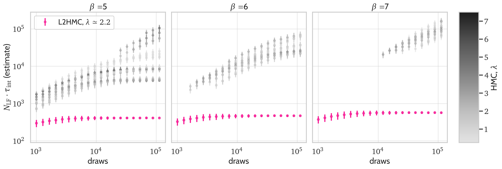

2. From this, look at how $`\tau_{\mathrm{int}}`$ varies with **trajectory length**, $`\lambda`$:
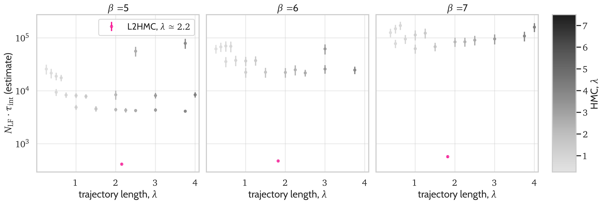

3. Finally, average these values over all considered trajectory lengths to get an estimate of $`\tau_{\mathrm{int}}`$ vs. $`\beta`$:
<p align="center" width="100%">
  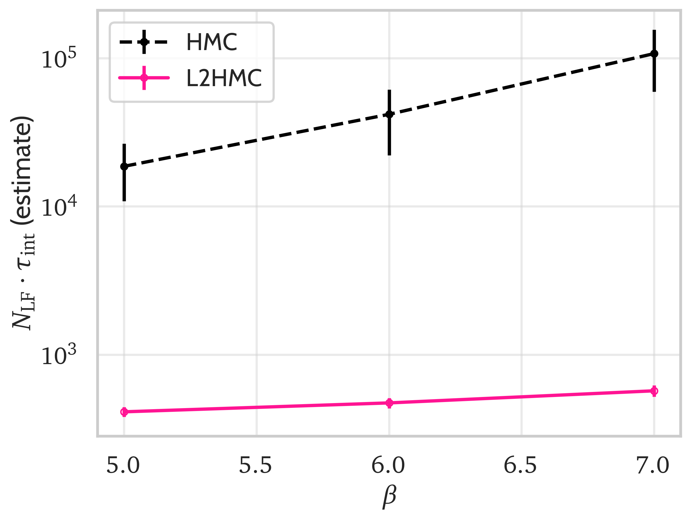
</p>